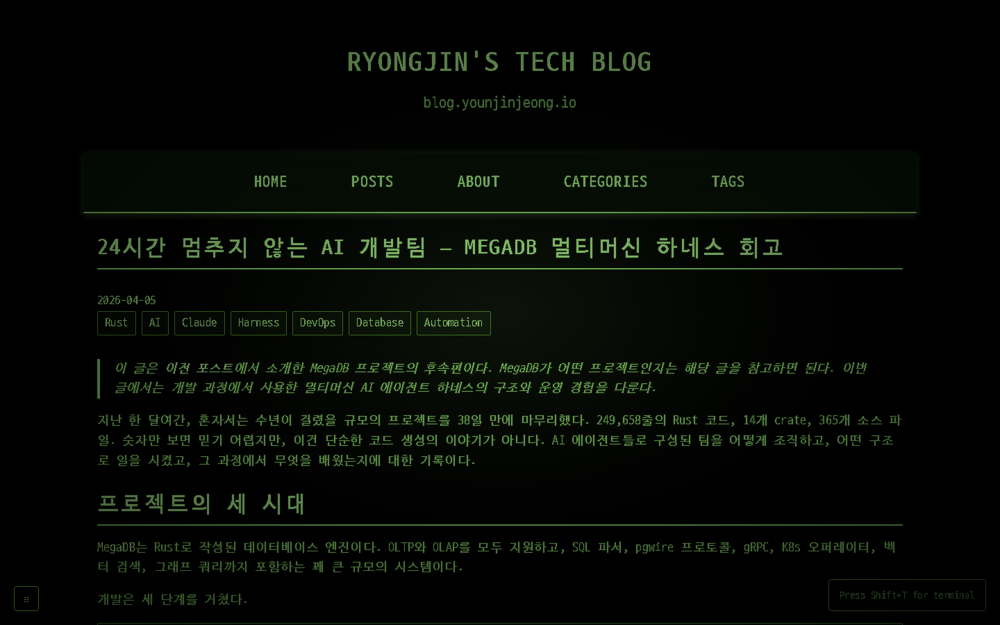

# RYONGJIN's Blog

[](https://github.com/younjinjeong/younjinjeong.github.io/actions/workflows/hugo.yml)
[](https://github.com/younjinjeong/younjinjeong.github.io/actions/workflows/e2e-tests.yml)

A personal tech blog with a unique **Fallout Pip-Boy terminal theme**, built with Hugo and hosted on GitHub Pages.

**Live Site:** [https://blog.younjinjeong.io](https://blog.younjinjeong.io)



---

## Tech Stack

| Component | Technology |
|-----------|------------|
| **Static Site Generator** | Hugo 0.128.0 (extended) |
| **Hosting** | GitHub Pages |
| **Custom Domain** | blog.younjinjeong.io |
| **Comments** | Giscus (GitHub Discussions) |
| **E2E Testing** | Playwright (Browser Automation) |
| **CMS** | Strapi (headless, optional) |
| **CI/CD** | GitHub Actions |
| **Analytics** | Google Analytics 4 |

### Frontend

- **Theme**: Custom Pip-Boy terminal style (Fallout-inspired)
- **CSS**: 1600+ lines of custom styling with CSS variables
- **Fonts**: DungGeunMo (Korean), Monofonto, VT323, Google Fonts
- **Effects**: CRT scanlines, glow effects, boot screen animation

### Development Tools

- **Orchestrator**: Automated development cycle (Plan → Build → Test → Review)
- **E2E Tests**: 38 Playwright-based browser tests with headless Chromium
- **Test Coverage**: Font display, image sizing, visual design, navigation, interactive elements

---

## Special Characteristics

### Pip-Boy Terminal Theme

The blog features a unique retro terminal aesthetic inspired by the Fallout video game series:

- **Color Scheme**: Phosphor green (`#41ff00`) on black background
- **Boot Sequence**: Animated initialization screen on first visit
- **Loading Transitions**: TV channel change sound effect between pages
- **Visual Effects**:
  - CRT scanline overlay
  - Text glow and flicker animations
  - Vignette effect
  - Blinking terminal cursor

### Mobile Experience

- Bottom navigation bar with swipe gestures
- Touch-friendly controls
- Responsive design (768px, 480px breakpoints)

### Multilingual Support

- Korean and English content
- Optimized font rendering for Korean characters
- Custom letter-spacing for readability

---

## CI/CD Pipeline

### Deployment Workflow (`hugo.yml`)

Triggered on push to `main` branch:

```
1. Install Hugo 0.128.0 (extended) + Dart Sass
2. Fetch content from Strapi CMS (if configured)
3. Build site with hugo --gc --minify
4. Create CNAME for custom domain
5. Deploy to GitHub Pages
```

### Strapi Webhook Workflow (`strapi-webhook.yml`)

Triggered by Strapi CMS on content publish/update:

```
1. Strapi fires webhook on publish → repository_dispatch
2. Fetch latest content from Strapi API
3. Hugo build + deploy to GitHub Pages
```

### E2E Test Workflow (`e2e-tests.yml`)

Triggered on push/PR to `main`:

```
1. Setup Node.js 20
2. Install Hugo CLI (v0.128.0)
3. Install npm dependencies
4. Install Playwright with Chromium browser
5. Run 38 Playwright E2E tests (auto-starts Hugo server)
6. Upload Playwright report, test results & screenshots
```

---

## Project Structure

```
├── config.toml              # Hugo configuration
├── content/                 # Blog posts and pages
│   ├── about.md
│   └── posts/
│       ├── Tech/
│       ├── k-pop/
│       └── thoughts/
├── layouts/                 # Custom templates (23 files)
│   ├── _default/
│   ├── partials/
│   └── index.html
├── static/
│   ├── css/pipboy.css      # Main theme (1600+ lines)
│   ├── js/                  # Boot screen, loading, mobile nav
│   ├── fonts/               # DungGeunMo, Monofonto
│   └── sounds/              # TV channel change effect
├── e2e/                     # Playwright E2E test suite
│   ├── tests/               # 5 spec files, 38 tests
│   ├── screenshots/         # Test screenshots
│   └── playwright-report/   # HTML test report
├── playwright.config.js     # Playwright configuration
├── orchestrator/            # Development cycle automation
│   ├── phases/              # Plan, Implement, Build, Test, Review
│   └── lib/                 # Utilities
├── scripts/                 # Strapi CMS integration scripts
│   ├── fetch-strapi-content.js   # Fetch content from Strapi API
│   ├── migrate-to-strapi.js      # Migrate Markdown to Strapi
│   └── strapi-setup/             # Strapi setup configs & schemas
└── .github/workflows/       # CI/CD pipelines
```

---

## Development

### Prerequisites

- Hugo 0.128.0+ (extended version)
- Node.js 20+
- npm

### Local Development

```bash
# Start dev server
hugo server -D

# Run E2E tests (starts server automatically)
npm run cycle:quick

# Full orchestration cycle
npm run orchestrate
```

### Available Scripts

```bash
# Hugo commands
npm run hugo:build       # Build for production
npm run hugo:serve       # Start dev server

# Playwright E2E tests
npm test                 # Run all 38 E2E tests (headless)
npm run test:headed      # Run tests with browser visible
npm run test:ui          # Interactive Playwright UI mode
npm run test:report      # View HTML test report

# Orchestrator (automated dev cycle)
npm run orchestrate      # Full cycle (Plan → Build → Test → Review)
npm run cycle:quick      # Quick cycle (Build → Test)
npm run cycle:full       # Full cycle with verbose logging

# Strapi CMS (optional)
npm run strapi:fetch     # Fetch content from Strapi API
npm run strapi:migrate   # Migrate local Markdown to Strapi
```

---

## How This Blog Works (Two-Repository Architecture)

This blog uses a **two-repository architecture** where content management and site rendering are separated:

```text
┌─────────────────────────────┐      ┌─────────────────────────────────┐
│  blog-cms (Private Repo)    │      │  younjinjeong.github.io (Public)│
│  github.com/younjinjeong/   │      │  github.com/younjinjeong/       │
│  blog-cms                   │      │  younjinjeong.github.io         │
│                             │      │                                 │
│  Strapi v5 CMS              │      │  Hugo 0.128.0 Static Site       │
│  - Write/edit posts         │      │  - Templates & theme            │
│  - Manage categories/tags   │      │  - Pip-Boy terminal CSS/JS      │
│  - Upload media             │      │  - E2E tests (Playwright)       │
│  - Google Analytics dashboard│      │  - CI/CD pipelines              │
│                             │      │                                 │
│  Hosted on: Render.com      │      │  Hosted on: GitHub Pages        │
│  (Free tier)                │      │  blog.younjinjeong.io           │
└──────────┬──────────────────┘      └──────────┬──────────────────────┘
           │                                    │
           │  REST API                          │
           │  /api/posts                        │
           │  /api/categories                   │
           │  /api/tags                         │
           └──────────────┐  ┌──────────────────┘
                          │  │
                          ▼  ▼
              ┌───────────────────────┐
              │   GitHub Actions      │
              │                       │
              │ 1. Fetch from Strapi  │
              │ 2. Generate Markdown  │
              │ 3. Hugo build         │
              │ 4. Deploy to Pages    │
              └───────────────────────┘
```

### Content Flow

1. **Write** a post in Strapi admin (`https://blog-cms-strapi-3lzr.onrender.com/admin`)
2. **Publish** the post in Strapi (or save as draft)
3. **Trigger** build — either via push to this repo, or Strapi webhook (`repository_dispatch`)
4. **Fetch** — GitHub Actions runs `scripts/fetch-strapi-content.js` to pull content from Strapi API
5. **Build** — Hugo generates static HTML from the fetched Markdown
6. **Deploy** — Static files are pushed to GitHub Pages at `blog.younjinjeong.io`

### Key Design Decisions

| Decision | Rationale |
|----------|-----------|
| Strapi is in a **separate private repo** | Keeps CMS config, DB credentials, and admin code isolated from the public blog |
| Content is **fetched at build time**, not runtime | Static site = fast, secure, free hosting on GitHub Pages |
| Strapi is **optional** | If `STRAPI_API_URL` is not set, the build uses local Markdown files in `content/posts/` |
| Google Analytics (GA4) | Tracking is embedded in Hugo templates; GA dashboard is available in Strapi admin |

### GitHub Secrets (this repo)

| Secret | Purpose |
|--------|---------|
| `STRAPI_API_URL` | Strapi instance URL (e.g. `https://blog-cms-strapi-3lzr.onrender.com`) |
| `STRAPI_API_TOKEN` | Full-access API token for fetching content |

### Relevant Scripts

| Script | Purpose |
|--------|---------|
| `scripts/fetch-strapi-content.js` | Fetches posts from Strapi REST API and generates Hugo-compatible Markdown files |
| `scripts/migrate-to-strapi.js` | One-time migration of local Markdown posts to Strapi |
| `scripts/strapi-setup/` | Content type schemas, Render deploy config, setup guide |

### Without Strapi

The blog works perfectly with local Markdown files in `content/posts/`. Strapi integration is fully optional — if the `STRAPI_API_URL` secret is not configured, the build uses local content.

---

## Contributing (Branch Strategy)

The `main` branch is **protected**. All changes must go through a Pull Request with owner approval.

```text
main (protected)        ← production, deploys to GitHub Pages
  └── feature/<name>    ← new features
  └── fix/<name>        ← bug fixes
  └── docs/<name>       ← documentation changes
```

### Workflow

1. Create a feature branch from `main`: `git checkout -b feature/<name>`
2. Make changes and commit
3. Push the branch: `git push origin feature/<name>`
4. Open a Pull Request to `main`
5. Wait for CI to pass and owner approval
6. Merge after approval

### Branch Protection Rules

- PR required with **1 approving review**
- **CI must pass** (`build` job)
- Stale reviews are dismissed on new commits
- Enforced for admins

---

## Author

**Younjin Jeong (RYONGJIN)**

- Tech Advisor to CEO @ MegazoneCloud
- Former:
  - CTO @ Focusmedia Korea
  - SVP @ Development Bank of Singapore (DBS), C2E
  - Principal Technologist @ Pivotal Software Inc.
  - Solutions Architect @ Amazon Web Services
  - Tech Lab Researcher @ Cafe24

---

## License

ISC
