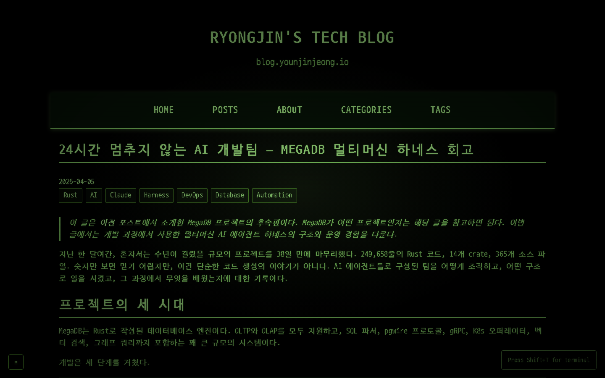
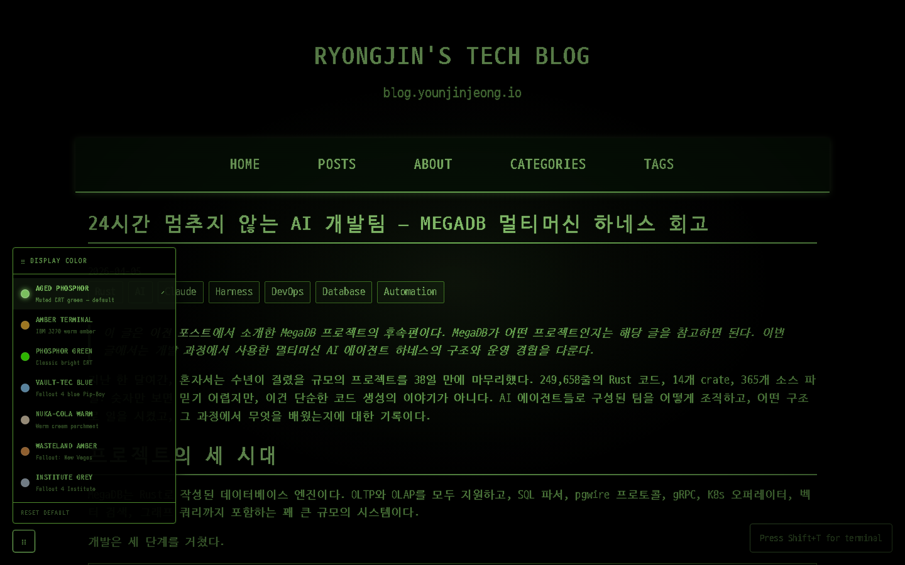

# RYONGJIN's Blog

[](https://github.com/younjinjeong/younjinjeong.github.io/actions/workflows/hugo.yml)
[](https://github.com/younjinjeong/younjinjeong.github.io/actions/workflows/e2e-tests.yml)
[](https://github.com/younjinjeong/younjinjeong.github.io/actions/workflows/gitleaks.yml)

A personal tech blog with a **Fallout Pip-Boy terminal theme**, built with Hugo and hosted on GitHub Pages.

**Live Site:** [https://blog.younjinjeong.io](https://blog.younjinjeong.io)



---

## Features

### Color Scheme Selector

Multiple CRT phosphor themes — click the panel icon (bottom-right) to switch:

- **Aged Phosphor** (default) — muted CRT green `#7ABF5E`
- **Amber Terminal** — warm IBM 3270 amber `#E0A830`
- Additional schemes with full syntax highlighting support

Persists in localStorage. Styled as a Fallout terminal config panel.



### BBS Terminal (Shift+T)

A full 1980s-style BBS command interpreter built into every page:

- `list` — browse posts by section
- `go <number>` — navigate to a result
- `search <pattern>` — regex search across all posts
- `help` — command reference
- `whoami` — about the author
- Command history with arrow keys
- Section-aware context (home, posts, categories, tags)

### Pip-Boy Theme

Retro-futuristic terminal aesthetic inspired by the Fallout series:

- **Boot Sequence** — animated initialization screen on first visit (skip with ESC)
- **CRT Effects** — scanline overlay, text glow, flicker animations, vignette
- **Loading Transitions** — TV channel change sound between pages
- **Terminal Cursor** — blinking prompt after post content
- **Fonts** — DungGeunMo (Korean retro), VT323, Press Start 2P, Share Tech Mono, IBM Plex Mono

### Multilingual (EN/KR)

- Automatic browser language detection with translation suggestion banner
- Language switcher toggle on bilingual posts (EN | KO)
- SEO `hreflang` alternate links for search engines
- Optimized Korean font rendering with custom letter-spacing

### Mobile Experience

- Bottom navigation bar (Back / Menu / Forward)
- Swipe gestures: left-edge for back, right-edge for forward
- Touch-friendly 60px control height with sound feedback
- Responsive breakpoints at 810px and 480px

---

## Tech Stack

| Component | Technology |
|-----------|------------|
| **Static Site Generator** | Hugo 0.128.0 (extended) |
| **Hosting** | GitHub Pages |
| **Custom Domain** | blog.younjinjeong.io |
| **Comments** | Giscus (GitHub Discussions) |
| **E2E Testing** | Playwright (57 tests, 4 browsers) |
| **CMS** | Strapi (headless, optional) |
| **CI/CD** | GitHub Actions (4 workflows) |
| **Security** | Gitleaks (secret scanning) |
| **Analytics** | Google Analytics 4 |
| **Theme** | Custom Pip-Boy terminal (1,879 lines CSS) |
| **Diagrams** | Mermaid (conditional loading) |

---

## CI/CD Pipeline

| Workflow | Trigger | Purpose |
|----------|---------|---------|
| `hugo.yml` | Push/PR to `main` | Build Hugo site + deploy to GitHub Pages |
| `e2e-tests.yml` | Push/PR to `main` | Run 57 Playwright E2E tests across 4 browsers |
| `gitleaks.yml` | Push/PR to `main` | Scan for leaked credentials and secrets |
| `strapi-webhook.yml` | Strapi publish event | Fetch CMS content + rebuild + deploy |

### Build Steps

```
1. Install Hugo 0.128.0 (extended) + Dart Sass
2. Fetch content from Strapi CMS (if configured)
3. Build site with hugo --gc --minify
4. Create CNAME for custom domain
5. Deploy to GitHub Pages
```

---

## E2E Testing

**57 tests** across **7 spec files**, running on **4 browser contexts** (228 total executions):

| Spec File | Tests | Coverage |
|-----------|-------|----------|
| `font-display.spec.js` | Font rendering, visibility |
| `image-sizing.spec.js` | Image dimensions, loading |
| `interactive.spec.js` | Boot screen, loading effects, navigation |
| `language-switcher.spec.js` | Multilingual detection, switching |
| `navigation.spec.js` | Nav components, categories, tags |
| `typography.spec.js` | Text rendering, Korean characters |
| `visual-design.spec.js` | CRT effects, glow, visual elements |

**Browser Contexts:** Desktop HD (1920x1080), Desktop, Tablet (810x1080), Mobile (Pixel 5)

---

## Project Structure

```
├── config.toml                  # Hugo configuration
├── .gitleaks.toml               # Secret scanning rules
├── playwright.config.js         # E2E test configuration
├── content/                     # Blog posts and pages
│   ├── about.md
│   └── posts/
│       ├── Tech/                # 12 posts (EN + KR)
│       ├── k-pop/               # 1 post
│       └── thoughts/            # 4 posts (EN + KR)
├── layouts/                     # Custom templates (23+ files)
│   ├── _default/                # Base, list, single templates
│   ├── categories/              # Taxonomy + term templates
│   ├── partials/                # Nav, boot screen, comments, etc.
│   └── shortcodes/              # YouTube, YouTube Shorts embeds
├── static/
│   ├── css/pipboy.css           # Main theme (1,879 lines)
│   ├── css/syntax.css           # Code highlighting
│   ├── js/
│   │   ├── boot-screen.js       # Boot sequence animation
│   │   ├── color-scheme-selector.js  # Color theme panel
│   │   ├── cursor.js            # BBS terminal system
│   │   ├── search-engine.js     # Regex search
│   │   ├── lang-detect.js       # Language auto-detection
│   │   └── mobile.js            # Mobile nav + gestures
│   ├── fonts/                   # DungGeunMo, D2Coding, Monofonto
│   └── sounds/                  # TV channel change effect
├── e2e/                         # Playwright E2E test suite
│   └── tests/                   # 7 spec files, 57 tests
├── orchestrator/                # Development cycle automation
│   └── phases/                  # Plan, Implement, Build, Test, Review
├── scripts/                     # Strapi CMS integration
│   ├── fetch-strapi-content.js  # Fetch from Strapi API
│   └── migrate-to-strapi.js    # Migrate Markdown to Strapi
└── .github/workflows/           # CI/CD pipelines (4 workflows)
```

---

## Development

### Prerequisites

- Hugo 0.128.0+ (extended version)
- Node.js 20+
- npm

### Local Development

```bash
# Start dev server
hugo server -D

# Run E2E tests (starts server automatically)
npm test

# Full orchestration cycle
npm run orchestrate
```

### Available Scripts

```bash
# Hugo
npm run hugo:build           # Build for production
npm run hugo:serve           # Start dev server

# Playwright E2E tests
npm test                     # Run all 57 tests (headless)
npm run test:headed          # Run with browser visible
npm run test:ui              # Interactive Playwright UI
npm run test:report          # View HTML test report

# Orchestrator (automated dev cycle)
npm run orchestrate          # Full: Plan -> Build -> Test -> Review
npm run cycle:quick          # Quick: Build -> Test
npm run cycle:full           # Full with verbose logging

# Strapi CMS (optional)
npm run strapi:fetch         # Fetch content from Strapi API
npm run strapi:migrate       # Migrate Markdown to Strapi
```

---

## Two-Repository Architecture

Content management and site rendering are separated:

```text
┌─────────────────────────────┐      ┌─────────────────────────────────┐
│  blog-cms (Private Repo)    │      │  younjinjeong.github.io (Public)│
│                             │      │                                 │
│  Strapi v5 CMS              │      │  Hugo 0.128.0 Static Site       │
│  - Write/edit posts         │      │  - Templates & theme            │
│  - Manage categories/tags   │      │  - Pip-Boy terminal CSS/JS      │
│  - Upload media             │      │  - E2E tests (Playwright)       │
│                             │      │  - CI/CD pipelines              │
│  Hosted on: Render.com      │      │  Hosted on: GitHub Pages        │
└──────────┬──────────────────┘      └──────────┬──────────────────────┘
           │                                    │
           │  REST API                          │
           └──────────────┐  ┌──────────────────┘
                          │  │
                          ▼  ▼
              ┌───────────────────────┐
              │   GitHub Actions      │
              │                       │
              │ 1. Fetch from Strapi  │
              │ 2. Generate Markdown  │
              │ 3. Hugo build         │
              │ 4. Deploy to Pages    │
              └───────────────────────┘
```

### Without Strapi

The blog works with local Markdown files in `content/posts/`. Strapi integration is optional — if `STRAPI_API_URL` is not configured, the build uses local content.

---

## Security

**Gitleaks** scans every push and PR for accidentally committed secrets:

- Default rules cover AWS keys, GCP credentials, GitHub tokens, generic passwords, and more
- Allowlisted: author email (`younjin.jeong@gmail.com`)
- Skips: `public/`, `node_modules/`, `themes/`, `.env.example`
- Config: `.gitleaks.toml`

---

## Author

**Younjin Jeong (RYONGJIN)**

- Tech Advisor to CEO @ MegazoneCloud
- Former: CTO @ Focusmedia Korea, SVP @ DBS Bank, Principal Technologist @ Pivotal, SA @ AWS

---

## License

ISC
