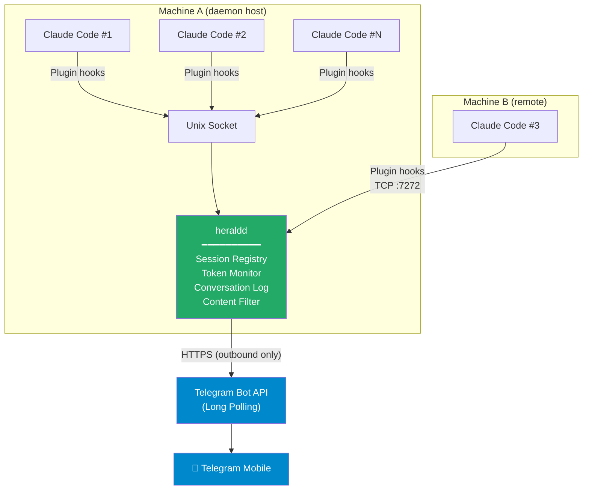
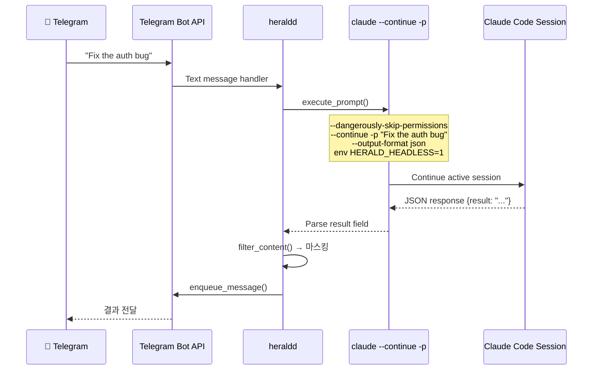
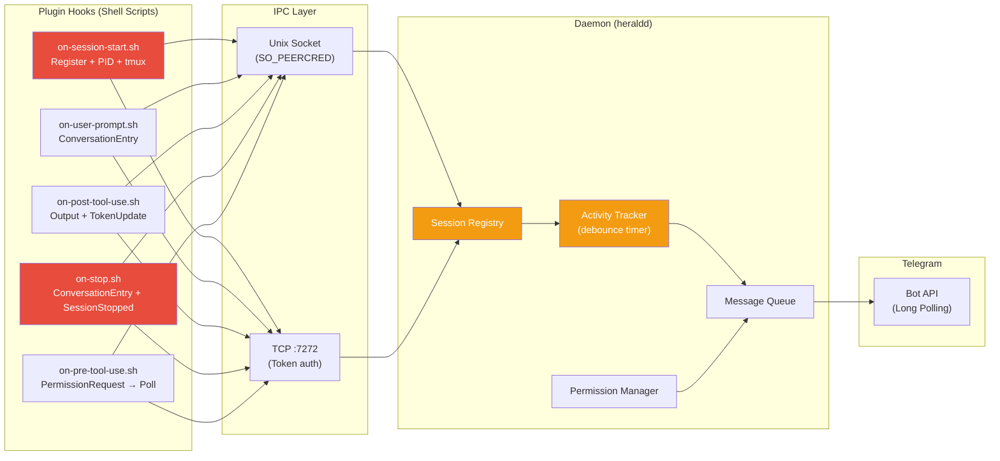

정윤진 ( younjin.jeong@gmail.com )


요즘 Claude Code를 쓰면서 느끼는 부분이 있다. 이 녀석이 정말 잘하긴 하는데, 작업을 하나 걸어놓고 나면 결국 터미널 앞에 붙어 앉아서 결과를 기다려야 한다는 점이다. 뭐 해보신 분들에게는 당연한 이야기겠지만, Claude Code가 뭔가 물어보기라도 하면 그때마다 화면을 들여다보고 있어야 하고, 특히 긴 작업의 경우엔 중간중간 토큰이 얼마나 쓰였는지, 지금 뭘 하고 있는지 확인하려면 터미널을 떠날 수가 없다.

여기에 머신이 여러 대가 되면 이야기가 더 복잡해진다. 회사 데스크탑에서 하나, 집에 있는 서버에서 하나, 가끔은 클라우드 위의 인스턴스에서도 Claude Code 세션을 돌리는데, 이걸 각각 SSH 붙어서 확인하다 보면 대체 내가 AI를 쓰는 건지 AI가 나를 쓰는 건지 모를 지경이 된다.

그래서 하나 만들었다.

---

## 왜 만들었는가

이 문제를 해결하는 기존 도구가 없는 건 아니다.

Anthropic이 올해 2월에 내놓은 Claude Code Remote Control이 있다. 터미널에서 `claude remote-control`을 실행하고 QR 코드를 스캔하면, Claude.ai 웹이나 iOS 앱에서 해당 세션을 제어할 수 있다. 깔끔하고, 공식 지원이고, TLS로 보안도 잘 되어 있다. 다만 제약이 좀 있는데, 일단 머신당 하나의 리모트 세션만 지원한다. 여러 개의 Claude Code 인스턴스를 병렬로 돌리는 사람에게는 맞지 않는다. 터미널을 닫으면 세션도 끝나버린다. 그리고 실제로 써보면 세션의 반응이 꽤 느리고, 연결을 쉽게 잃어버린다. 리모트라는 이름을 달고 있지만, 안정적으로 사용하기엔 아직 부족한 느낌이다.

그 다음 [OpenClaw](https://openclaw.ai/)가 있다. 이건 좀 결이 다른 도구인데, 오픈소스 자율형 AI 에이전트라고 보면 된다. WhatsApp, Telegram, Discord, Signal 같은 메신저를 인터페이스로 사용한다는 점은 내가 원하는 방향과 비슷하다. 그런데 OpenClaw의 철학은 "에이전트가 알아서 일한다"는 쪽이다. GitHub 레포를 모니터링하고, 받은 편지함을 정리하고, 미팅을 잡아주는 — 사용자가 자고 있는 동안에도 동작하는 프로액티브한 에이전트를 지향한다.

이게 멋진 비전이긴 한데, 나한테 필요한 건 그런 게 아니었다. 나는 AI가 알아서 돌아다니면서 뭔가를 하는 게 아니라, 내가 직접 통제하는 Claude Code 세션의 입출력을 원격에서 주고받고 싶었을 뿐이다. 거기에 OpenClaw 쪽은 보안 이슈도 있었다. 서드파티 스킬을 통한 데이터 유출이나 프롬프트 인젝션 사례가 보고된 적이 있어서, 실제 업무 환경에서 쓰기엔 좀 꺼림칙한 부분이 있다.

정리하자면 이렇다. Claude Code Remote Control은 단일 세션에 느린 반응 속도, OpenClaw는 내가 원하는 것과 방향 자체가 다르다. 나한테 필요한 건 좀 더 단순하고 직접적인 거였다. 프라이빗하고, 가볍게 동작하는 도구.

여러 대의 머신에서 돌아가는 여러 개의 Claude Code 세션을, 내가 이미 매일 쓰고 있는 메신저 하나에서 모아보고 제어하는 것. 마치 사람한테 말 걸듯이 세션에 지시를 내리고, 결과를 받아보는 것. 그리고 이 모든 통신의 주도권이 나한테 있는 것.

그래서 텔레그램을 선택했다. 인바운드 포트가 필요 없고 (Long Polling 방식이니까), 봇 API가 깔끔하고, 무엇보다 이미 설치되어 있으니까. 여기에 텔레그램은 MarkdownV2 포매팅을 지원하기 때문에 코드 블록이나 강조 텍스트가 깔끔하게 렌더링되고, 인라인 키보드 버튼도 쓸 수 있어서 권한 승인 같은 선택이 필요한 상황에서 Approve/Deny 버튼을 띄울 수 있다. 채팅 앱 치고는 꽤 쓸만한 UI를 만들 수 있다는 이야기다.

이름은 Herald로 지었다. 전령이라는 뜻인데, Claude Code의 작업 상황을 나한테 전달해주는 역할이니 이름값은 하는 셈이다.

---

## 어떻게 동작하는가

구조는 이렇다.



핵심은 `heraldd`라는 데몬이다. 이 녀석이 로컬에서는 Unix Socket으로, 원격 머신에서는 TCP 7272 포트로 Claude Code 세션들의 이벤트를 받아서 텔레그램으로 중계해준다. 아웃바운드 HTTPS만 나가면 되니까 방화벽 뒤에서도 문제없이 동작한다.

여기서 중요한 건, Claude Code의 Plugin hooks 시스템을 활용한다는 점이다. 세션이 시작되면 자동으로 등록되고, 사용자가 프롬프트를 날리면 그게 캡처되고, 도구 사용 결과도 중계되고, 세션이 끝나면 자동으로 등록이 해제된다. 뭐 한번 설정해놓으면 신경 쓸 일이 없다는 이야기다.

---

## 멀티 머신, 멀티 세션

내가 이 도구를 만든 가장 큰 이유 중 하나가 바로 이거다. 회사 머신에서 프론트엔드 작업 돌리고, 집 서버에서 백엔드 리팩토링 걸어놓고, 이동 중에 텔레그램에서 `/sessions` 치면 전부 한눈에 보인다.

각 세션별로 토큰 사용량과 비용도 추적이 된다. `/tokens` 명령을 치면 세션별로 인풋/아웃풋 토큰, 캐시 히트, 예상 비용까지 나온다. Claude Code를 많이 쓰는 사람이라면 이게 얼마나 유용한지 알 것이다. 특히 여러 세션을 동시에 돌릴 때 비용이 어디서 나가는지 추적하는 건 거의 필수에 가깝다.

원격 머신 설정도 간단하다. 데몬 호스트에서 TCP 리스너를 열어두고, 원격 머신에서 Herald 플러그인을 설치한 뒤 데몬 주소를 연결해주면 끝이다. Claude Code의 플러그인 시스템을 그대로 활용하기 때문에, 플러그인 설치 후에는 Claude Code를 그냥 실행하면 된다.

```bash
# 플러그인 설치 (한번만)
claude plugins marketplace add /path/to/Herald/plugin
claude plugins install herald@herald-local

# Claude Code 세션 안에서 원격 데몬 연결
/herald-connect daemon-host:7272
```

플러그인의 config.env에 `HERALD_DAEMON_ADDR`가 저장되므로, 한번 연결하면 이후 세션에서는 자동으로 TCP로 원격 데몬에 붙는다. 로컬로 돌아가고 싶으면 `/herald-disconnect`하면 Unix 소켓 모드로 복귀된다.

---

## 보안 이야기

원격 제어라는 단어가 나오면 당연히 보안 이야기가 따라온다. 이 부분은 꽤 신경을 썼다.

일단 텔레그램 봇 토큰은 시스템 키링에 저장된다. 리눅스에서는 libsecret, macOS에서는 Keychain을 사용한다. 설정 파일에 토큰이 평문으로 들어가는 건 좀 아닌 것 같아서. 컨테이너 환경에서는 어쩔 수 없이 환경변수를 쓰지만, 그건 K8s Secret이나 Docker secret으로 관리하면 된다.

로컬 IPC의 경우 Linux에서는 `SO_PEERCRED`, macOS에서는 `getpeereid`를 통해 소켓에 연결하는 프로세스의 UID를 확인한다. 다른 사용자가 내 Herald 데몬에 붙을 수 없다는 이야기다.

초기 설정 시에는 OTP 방식을 사용한다. 셋업 위저드에서 6자리 코드가 나오면 그걸 텔레그램 봇에 보내는 방식으로, 5분 제한에 3번까지 시도 가능하다. 한번 인증되면 chat_id가 설정에 저장되어 그 이후로는 해당 텔레그램 계정에서만 명령을 받는다.

그리고 컨텐츠 필터링. Claude Code의 출력에 API 키나 패스워드 같은 민감 정보가 포함될 수 있으니까, 텔레그램으로 중계되기 전에 자동으로 마스킹 처리된다. 코드 블록도 요약해서 보내주고, 전체 출력이 필요하면 로그를 확인하면 된다.

다만 솔직히 말하면, 보안 쪽은 아직 갈 길이 멀다. [GitHub Issues](https://github.com/younjinjeong/Herald/issues)를 보면 현재 10개의 이슈가 열려 있는데, 전부 보안 관련이다. TCP 기본 리슨 주소가 `0.0.0.0`으로 되어 있어서 외부에 그대로 노출되는 문제, `ListSessions`이나 `Health` 같은 IPC 엔드포인트에 인증이 빠져 있는 문제, 토큰 비교 시 타이밍 어택에 취약한 문제, 퍼미션 요청이 타임아웃되면 자동 허용되는 문제, `session_id` 포맷 검증이 없어서 path traversal이 가능한 문제 등. Critical이 4개, High가 3개다. 아직 구멍이 많고, 채워야 할 것들이 산더미다.

---

## 대화 로깅

텔레그램으로 날아오는 메시지만으로도 대부분의 상황 파악이 되지만, 전체 기록이 필요한 경우를 위해 파일 로그도 남긴다. 형태는 이런 식이다.

```
👤 You: "login.rs의 인증 버그 수정해줘"
🤖 Claude: "문제를 찾았습니다 — 토큰 검증에서 만료 체크를
건너뛰고 있었습니다. verify_token 함수에 타임스탬프
비교를 추가했습니다."
🔧 Tool: Edit login.rs (+5 -2)
```

코드 블록이나 커맨드 출력은 자동으로 걸러내고, 핵심적인 대화 내용만 남긴다. 나중에 "아 그때 그 세션에서 뭘 했더라" 싶을 때 유용하다.

---

## 컨테이너와 Kubernetes

코드에는 Docker와 K8s 지원이 들어가 있다. Dockerfile, docker-compose.yml, K8s 매니페스트까지 전부 준비되어 있고, 컨테이너 모드에서는 자동으로 stdout에 구조화된 JSON 로그를 출력하고, Unix 소켓 대신 TCP를 사용하고, 토큰 기반 인증으로 전환되도록 설계했다. Promtail과 Loki를 붙이면 Grafana에서 전체 세션 로그를 대시보드로 볼 수 있는 구조다.

```bash
# 단독 실행
docker run -d \
  -e HERALD_BOT_TOKEN=your_token \
  -p 7272:7272 \
  herald

# Loki 모니터링과 함께
docker compose --profile monitoring up -d
```

다만 솔직하게 말하면, 컨테이너와 K8s 환경에서는 아직 제대로 테스트를 해보지 못했다. 코드와 설정 파일은 있지만, 실제로 돌려보면서 검증한 건 Linux 네이티브 환경뿐이다. 컨테이너 안에서 Claude Code를 실행하는 것 자체가 좀 다른 이야기이기도 하고, 이 부분은 추후 작업이 필요하다.

---

## 기술적인 이야기

Rust로 만들었다. 비동기 런타임은 tokio, 텔레그램 봇 API는 teloxide, CLI 파싱은 clap을 사용한다. Rust를 선택한 이유는 뭐 여러가지가 있지만, 데몬으로 계속 떠 있어야 하는 프로세스니까 메모리 관리가 깔끔한 게 좋았고, Unix 소켓이나 시그널 핸들링 같은 시스템 레벨의 작업을 할 때 nix 크레이트가 잘 되어 있어서.

프로젝트 구조는 Rust workspace로 되어 있다. `herald-core`가 공통 라이브러리이고, `herald-cli`가 사용자용 CLI 바이너리, `herald-daemon`이 실제 데몬 바이너리다. Plugin은 셸 스크립트로 되어 있어서 Claude Code의 각 이벤트 훅에 연결된다.

```
Herald/
├── crates/
│   ├── herald-core/       # 공통 라이브러리 (설정, IPC, 인증, 텔레그램)
│   ├── herald-cli/        # CLI 바이너리 (herald)
│   └── herald-daemon/     # 데몬 바이너리 (heraldd)
├── plugin/                # Claude Code 플러그인 (셸 스크립트 훅)
├── k8s/                   # Kubernetes 매니페스트
├── Dockerfile
└── docker-compose.yml
```

---

## AI와 함께 만들면서 배운 것들

Herald는 Claude Code (Opus)와 함께 만들었다. 커밋 로그를 보면 대부분 `Co-Authored-By: Claude Opus 4.6`이 붙어 있다. 처음 scaffold부터 텔레그램 통합, TCP 트랜스포트, 컨테이너 지원까지 전부. 그 과정에서 몇 가지 뼈아픈 교훈을 얻었는데, AI 코딩을 많이 하는 사람이라면 공감할 부분이 있을 것이다.


### End-to-End 테스트를 알려주지 않으면, 토큰과 시간을 태우게 된다

AI와 코딩할 때 가장 중요한 것 하나만 꼽으라면, 구현한 기능의 end-to-end 테스트를 어떻게 수행하는지 명확하게 알려주는 것이다. 이걸 빠뜨리면 AI는 유닛 테스트가 통과하는 것만 보고 "완료"라고 판단해버리고, 실제로 돌려보면 안 되는 상황이 반복된다.

Herald의 경우가 딱 그랬다. 커밋 히스토리를 보면 이런 패턴이 보인다.

```
47bfd0d fix: use --continue instead of --resume for active session prompts
42a84e2 fix: handle empty headless responses gracefully
6a6f639 fix: add --dangerously-skip-permissions to headless execution
6c50c84 feat: add debug logging to headless execution and Input handler
```

헤드리스 프롬프트 실행 하나에 fix 커밋이 4개나 붙었다. `--resume`이 활성 세션에서는 동작하지 않아서 `--continue`로 바꾸고, 빈 응답이 오면 텔레그램이 크래시 나서 빈 응답 처리를 추가하고, 권한 시스템이 헤드리스에서 도구 실행을 차단해서 `--dangerously-skip-permissions`를 넣고, 그래도 텔레그램에 메시지가 안 도착해서 디버그 로깅을 추가하고. 매번 한 조각씩만 고쳐나간 것이다.

이걸 처음부터 "텔레그램에서 메시지를 보내면 Claude Code가 실행하고 결과가 텔레그램으로 돌아오는 전체 흐름을 테스트해라"고 지시했다면, 한두 번의 반복으로 끝났을 작업이다. 부분만 고치느라 토큰과 돈과 시간을 낭비한 전형적인 케이스. 실제로 마지막에는 그렇게 했다. end-to-end 테스트 시나리오를 명시적으로 지시하고 나서야, 비로소 한 라운드 안에 문제들이 함께 잡히기 시작했다.

데이터 흐름을 그려보면 이해가 쉽다.



이 흐름에서 한 군데만 틀어져도 전체가 안 된다. `--resume` 대신 `--continue`를 써야 하고, `HERALD_HEADLESS=1`을 넣어야 원래 세션이 덮어쓰기당하지 않고, 퍼미션 스킵 플래그가 있어야 도구가 실행되고, JSON 파싱이 되어야 결과가 추출된다. 근데 AI한테 "헤드리스 실행 기능 만들어줘"라고만 하면, 이 중 하나씩만 빠뜨려서 계속 안 되는 것이다.


### Linux 데몬과 IPC, AI에게는 익숙하지 않은 영역

두 번째로 느낀 건, Unix 데몬이나 IPC 같은 시스템 프로그래밍 영역이 AI에게 그다지 익숙하지 않다는 점이다. 웹 애플리케이션이나 CLI 도구라면 학습 데이터가 넘쳐나겠지만, `SO_PEERCRED`로 피어 크레덴셜 검증하고, systemd 유닛 파일의 `ProtectHome`과 `NoNewPrivileges` 설정하고, Unix 소켓의 length-prefixed JSON 프로토콜을 구현하는 것 같은 작업은 확실히 시행착오가 많았다.

커밋 로그가 증거다.

```
084c6c2 fix: systemd unit fails with NAMESPACE error
3e3d3a1 fix: always write token file so daemon can read it without D-Bus
bccc811 fix: register Claude process PID instead of hook shell PID
cc5e7e7 fix: hook scripts fail on Linux/macOS due to CRLF line endings
```

systemd에서 `ProtectHome=read-only`를 설정했는데 홈 디렉토리 아래에 런타임 디렉토리를 만들려고 하니 NAMESPACE 에러가 나고. 키링에 토큰을 잘 저장했는데 systemd 유닛 안에서는 D-Bus 세션이 없어서 키링 접근이 안 되고. 셸 스크립트 훅에서 `$$`로 PID를 가져왔는데 그건 훅 셸의 PID이지 실제 Claude 프로세스의 PID가 아니고. Windows에서 커밋한 셸 스크립트가 CRLF로 들어가서 Linux에서 실행이 안 되고.

이런 것들은 시스템 관리를 해본 사람이라면 한번쯤 겪어봤을 문제들이다. 하지만 AI는 이런 런타임 환경의 미묘한 차이를 코드만 보고는 잡아내지 못한다. `SO_PEERCRED`가 Linux에서는 되는데 macOS에서는 `getpeereid`를 써야 한다는 것, systemd 안에서 D-Bus 세션 버스에 접근이 안 된다는 것, 이런 건 실제로 돌려봐야 알 수 있는 것들이다.


### 작은 것들이 전체를 무너뜨린다 — MSA와 같은 교훈

세 번째이자 가장 중요한 교훈. Herald는 겉보기에 단순한 구조다. Plugin hook이 이벤트를 캡처하고, IPC로 데몬에 전달하고, 데몬이 텔레그램으로 중계한다. 그런데 이 "단순한" 파이프라인에서 여러 컴포넌트를 통해 데이터가 흐르면, 항상 작은 것들이 전체 문제를 만들어낸다. 마치 마이크로서비스 아키텍처처럼.

한번은 텔레그램 릴레이가 통째로 죽어버린 적이 있다. 커밋 `a95abe2`를 보면 한 번에 6개의 버그를 고치고 있다. 상태 기반 완료 감지를 넣었더니, 어시스턴트 턴마다 "Session ended"가 날아가고, tmux 환경에서 세션 등록이 안 되고, Output 이벤트가 user_prompt 전에 오면 조용히 씹히고, 데몬 재시작 후 토큰이 무효화되면서 세션이 전부 날아가고.

이게 전부 다른 컴포넌트에서 발생한 문제들인데, 하나가 다른 하나의 전제 조건을 무너뜨리면서 연쇄적으로 터진 것이다.



이 다이어그램을 보면 알겠지만, 셸 스크립트 훅 5개, IPC 트랜스포트 2종, 데몬 내부 상태 관리 3개, 텔레그램 봇까지 — 컴포넌트가 작다고 해서 복잡도가 낮은 게 아니다. 세션 등록 시 토큰을 파일로 저장하는 로직이 TCP에서만 동작해야 하고, Unix 소켓에서는 `peercred`로 인증을 대체하지만 세션 존재 여부는 여전히 확인해야 하고, 데몬이 재시작되면 401이 오니까 훅 스크립트가 자동으로 재등록해야 하고, 근데 410 (세션 미등록)도 같은 로직으로 처리해야 하고.

전체를 보되 디테일을 모르면 문제에 빠지기 쉽다. AI는 전체 구조를 잘 잡아주지만, 이런 컴포넌트 간의 상호작용에서 생기는 엣지 케이스는 사람이 잡아줘야 한다. 결국 시스템을 이해하는 사람이 "이 흐름 전체를 처음부터 끝까지 테스트해봐"라고 말해줘야, AI가 제대로 된 결과물을 내놓을 수 있다.

뭐 예전에 memcached 쓸 때도, strace 걸면서 시스템 콜 단위로 추적하던 그 노가다가 결국은 가장 확실한 디버깅 방법이었던 것처럼 — AI 시대에도 end-to-end로 실제 돌려보는 것만큼 확실한 건 없다.

---

## 설치와 시작

설치는 간단하다. Rust 툴체인이 있다면 소스에서 빌드하면 되고, 없다면 Docker로 바로 돌릴 수 있다.

```bash
git clone https://github.com/younjinjeong/Herald.git
cd Herald
cargo build --release
cp target/release/herald target/release/heraldd ~/.local/bin/
```

셋업 위저드를 실행하면 봇 토큰 입력부터 텔레그램 인증까지 단계별로 안내해준다.

```bash
herald setup    # 대화형 설정 위저드
herald start    # 데몬 시작
```

그 다음은 Claude Code에 Herald 플러그인을 설치한다.

```bash
# 플러그인 등록 및 설치
claude plugins marketplace add /path/to/Herald/plugin
claude plugins install herald@herald-local

# 이후 Claude Code를 그냥 실행하면 플러그인이 자동으로 로드된다
claude
```

텔레그램에서 `/start` 를 보내면 연결 완료. 이후로는 텔레그램에서 텍스트 메시지를 보내면 그게 선택된 Claude Code 세션에 프롬프트로 전달된다.

---

## 마치며

고칠 것도 많고, 보안 이슈도 쌓여있고, 컨테이너 테스트도 안 됐고. 그래도 아무튼 흥미로운 프로젝트였다. 단순해 보이는 문제 하나로 하루를 통째로 태우면서 고생한 적도 있었지만, 그 과정에서 AI와 코딩하는 방법에 대해 꽤 많은 걸 배웠다.

특히 긴 작업을 걸어놓고 외출할 때, 텔레그램으로 중간중간 상황을 확인하고, 필요하면 추가 지시를 내릴 수 있다는 게 생각보다 큰 차이를 만든다. 여러 머신에서 동시에 작업할 때는 말할 것도 없고. 만들어놓고 보니 꽤 유용해서, 이제는 이거 없이 Claude Code를 쓰기가 오히려 불편해졌다.

관심 있으면 한번 써보시길. 다만, 사용은 각자의 책임이다. 앞서 말했듯이 아직 구멍이 많아서, 채워야 한다. ㅎ

라이센스는 MIT이고, 소스는 아래 GitHub에서 확인할 수 있다.

- GitHub: [https://github.com/younjinjeong/Herald](https://github.com/younjinjeong/Herald)
