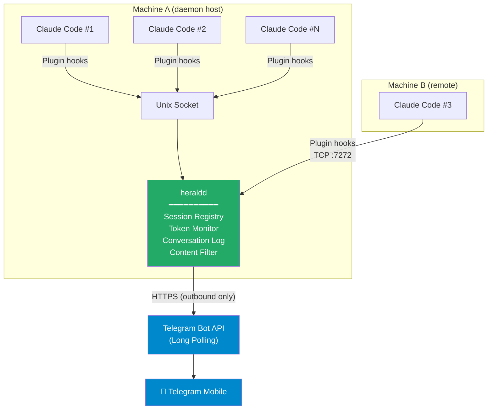
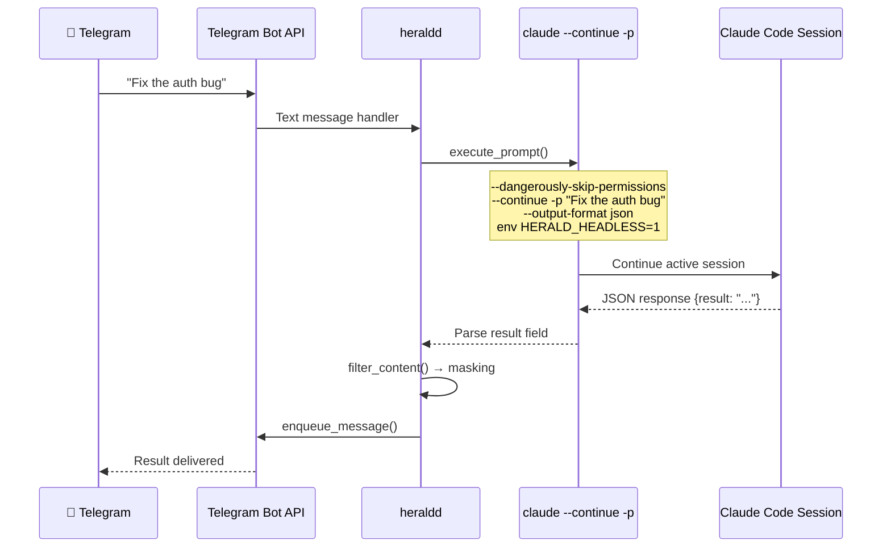
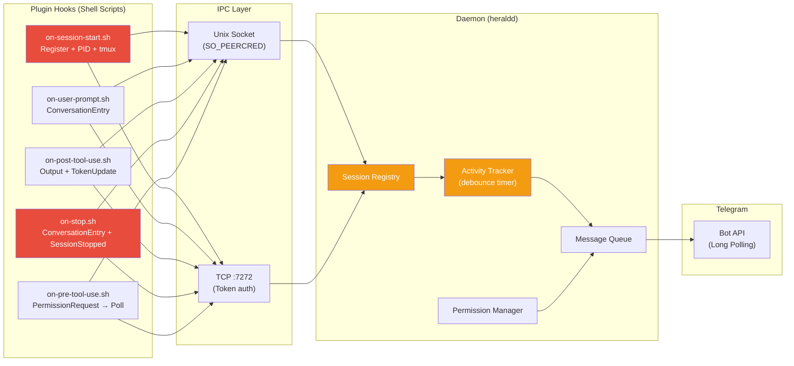

Youngjin Jeong ( younjin.jeong@gmail.com )


Something has been bugging me about Claude Code lately. It's genuinely impressive at what it does, but once you kick off a task, you're stuck in front of the terminal waiting for it to finish. Anyone who's used it knows the drill — Claude Code asks you a question, you have to be there staring at the screen. Especially on long-running tasks, checking how many tokens have been consumed or what it's currently doing means you can't walk away from the terminal.

Now add multiple machines to the mix. One session on the office desktop, another on the home server, sometimes one more on a cloud instance. SSH into each one to check progress, and at some point you start wondering whether you're using the AI or the AI is using you.

So I built something.

---

## Why I Built This

It's not like tools for this problem don't exist.

Anthropic shipped Claude Code Remote Control back in February. Run `claude remote-control` in your terminal, scan a QR code, and you can control the session from Claude.ai web or the iOS app. Clean, officially supported, TLS-secured. But it has some limitations. For one, it only supports a single remote session per machine. If you're the kind of person who runs multiple Claude Code instances in parallel, it's not a fit. Close the terminal, session's gone. And in practice, the session response is sluggish and the connection drops easily. It carries the name "remote," but it doesn't feel reliable enough for steady use yet.

Then there's [OpenClaw](https://openclaw.ai/). This one is a different animal entirely — it's an open-source autonomous AI agent. It uses messaging apps like WhatsApp, Telegram, Discord, and Signal as its interface, which sounded close to what I wanted. But OpenClaw's philosophy is "the agent works on its own." It monitors your GitHub repos, cleans out your inbox, schedules meetings — a proactive agent that keeps going while you sleep.

That's a cool vision, but it wasn't what I needed. I didn't want an AI wandering around doing things on its own. I wanted to send and receive I/O from Claude Code sessions that I'm directly controlling, remotely. And there were security concerns with OpenClaw — data exfiltration and prompt injection through third-party skills had been reported, which made me uneasy about using it in a real work environment.

So here's the summary. Claude Code Remote Control is constrained to a single session with slow response times. OpenClaw is solving a fundamentally different problem. What I needed was something simpler and more direct. Private, and lightweight.

Multiple Claude Code sessions running across multiple machines, managed from a single messenger I already use every day. Sending instructions to sessions like talking to a person, getting results back. And keeping full control over the communication.

That's why I chose Telegram. No inbound ports needed (long polling), a clean Bot API, and most importantly, it was already installed on my phone. On top of that, Telegram supports MarkdownV2 formatting, so code blocks and emphasized text render cleanly. It also has inline keyboard buttons, which means I can pop up Approve/Deny buttons when permission decisions are needed. For a chat app, you can build a surprisingly usable UI.

I named it Herald. As in the messenger who delivers news — fitting for something that relays Claude Code's work status back to me.

---

## How It Works

Here's the architecture.



At the core is a daemon called `heraldd`. Locally it receives events from Claude Code sessions via Unix Socket, and from remote machines via TCP on port 7272, then relays everything to Telegram. Since it only needs outbound HTTPS, it works behind firewalls without any issues.

The key design choice is leveraging Claude Code's Plugin hooks system. Sessions auto-register on start, user prompts get captured, tool outputs get relayed, and sessions auto-unregister on exit. Set it up once and forget about it.

---

## Multi-Machine, Multi-Session

This is one of the biggest reasons I built this tool. Run a frontend task on the office machine, kick off a backend refactor on the home server, and while commuting, type `/sessions` in Telegram to see everything at a glance.

Token usage and costs are tracked per session too. The `/tokens` command shows input/output tokens, cache hits, and estimated cost per session. If you're a heavy Claude Code user, you know how valuable this is. Tracking where costs are coming from when running multiple sessions simultaneously is practically a necessity.

Setting up remote machines is straightforward. Open a TCP listener on the daemon host, install the Herald plugin on the remote machine, and connect to the daemon. Since it uses Claude Code's built-in plugin system, you just run Claude Code normally after installation.

```bash
# Install the plugin (one-time)
claude plugins marketplace add /path/to/Herald/plugin
claude plugins install herald@herald-local

# Inside a Claude Code session, connect to the remote daemon
/herald-connect daemon-host:7272
```

The daemon address gets saved to the plugin's config.env as `HERALD_DAEMON_ADDR`, so subsequent sessions automatically connect to the remote daemon via TCP. Want to switch back to local? `/herald-disconnect` reverts to Unix socket mode.

---

## Security

When remote control comes up, security naturally follows. I put some effort into this part.

The Telegram bot token is stored in the system keyring. On Linux that's libsecret, on macOS it's Keychain. Storing tokens as plaintext in a config file didn't feel right. In container environments you're stuck with environment variables, but those can be managed through K8s Secrets or Docker secrets.

For local IPC, Linux uses `SO_PEERCRED` and macOS uses `getpeereid` to verify the UID of connecting processes. No other user can connect to your Herald daemon.

Initial setup uses OTP verification. The setup wizard shows a 6-digit code, you send it to the Telegram bot — 5-minute timeout, 3 attempts max. Once verified, the chat_id is stored in the config and the daemon only accepts commands from that Telegram account going forward.

Then there's content filtering. Since Claude Code's output can contain API keys or passwords, sensitive information is automatically masked before being relayed to Telegram. Code blocks get summarized, and if you need the full output, check the logs.

That said, I'll be upfront — there's still a long way to go on security. Check the [GitHub Issues](https://github.com/younjinjeong/Herald/issues) and you'll find 10 open issues, all security-related. The default TCP listen address is `0.0.0.0` — wide open to the network. IPC endpoints like `ListSessions` and `Health` have no authentication. Token comparison is vulnerable to timing attacks. Permission requests auto-allow on timeout. No format validation on `session_id`, leaving it open to path traversal. Four critical, three high priority. There are plenty of holes, and plenty of work left to fill them.

---

## Conversation Logging

The Telegram messages alone give you a good picture of what's happening, but for cases where you need a complete record, there's also file-based logging. It looks like this:

```
👤 You: "Fix the authentication bug in login.rs"
🤖 Claude: "I found the issue — the token validation was
skipping the expiry check. I've updated the verify_token
function to include a timestamp comparison."
🔧 Tool: Edit login.rs (+5 -2)
```

Code blocks and command outputs are automatically stripped, keeping only the essential conversation. Useful for those moments when you think, "What did I do in that session again?"

---

## Containers and Kubernetes

The codebase includes Docker and K8s support. Dockerfile, docker-compose.yml, K8s manifests — it's all there. Container mode is designed to output structured JSON logs to stdout, use TCP instead of Unix sockets, and switch to token-based auth. Hook up Promtail and Loki, and you get a Grafana dashboard for all session logs.

```bash
# Standalone
docker run -d \
  -e HERALD_BOT_TOKEN=your_token \
  -p 7272:7272 \
  herald

# With Loki monitoring
docker compose --profile monitoring up -d
```

But I'll be honest — the container and K8s environments haven't been properly tested yet. The code and config files exist, but the only environment where I've actually run and verified things is native Linux. Running Claude Code inside a container is a different story altogether, and this is something that needs future work.

---

## Technical Details

Built in Rust. Async runtime is tokio, Telegram Bot API is teloxide, CLI parsing is clap. Why Rust? Several reasons, but mainly: this is a daemon that stays running all the time, so clean memory management matters. And the nix crate does an excellent job with system-level operations like Unix sockets and signal handling.

The project is structured as a Rust workspace. `herald-core` is the shared library, `herald-cli` is the user-facing CLI binary, and `herald-daemon` is the actual daemon binary. Plugins are shell scripts that hook into Claude Code's event system.

```
Herald/
├── crates/
│   ├── herald-core/       # Shared library (config, IPC, auth, Telegram)
│   ├── herald-cli/        # CLI binary (herald)
│   └── herald-daemon/     # Daemon binary (heraldd)
├── plugin/                # Claude Code plugin (shell script hooks)
├── k8s/                   # Kubernetes manifests
├── Dockerfile
└── docker-compose.yml
```

---

## What I Learned Building This with AI

Herald was built with Claude Code (Opus). Look at the commit log and most entries carry `Co-Authored-By: Claude Opus 4.6`. From the initial scaffold to Telegram integration, TCP transport, container support — all of it. Along the way I picked up some painful lessons, and if you do a lot of AI-assisted coding, some of this might ring a bell.


### Without End-to-End Testing Instructions, You'll Burn Tokens and Time

If I had to pick the single most important thing about coding with AI, it's this: you have to explicitly tell it how to end-to-end test the feature you just built. Skip this, and the AI sees unit tests passing and declares "done," while the actual thing doesn't work. This cycle repeats.

Herald was a textbook case. Look at the commit history for this pattern:

```
47bfd0d fix: use --continue instead of --resume for active session prompts
42a84e2 fix: handle empty headless responses gracefully
6a6f639 fix: add --dangerously-skip-permissions to headless execution
6c50c84 feat: add debug logging to headless execution and Input handler
```

Four fix commits for a single headless prompt execution feature. `--resume` didn't work on active sessions so it became `--continue`. Empty responses crashed Telegram so we added empty handling. The permission system blocked headless tool execution so we added `--dangerously-skip-permissions`. Messages still weren't arriving in Telegram so we added debug logging. One patch at a time.

If I'd said from the start, "test the entire flow: send a message from Telegram, Claude Code executes, result comes back to Telegram" — it would have been done in one or two iterations. A classic case of wasting tokens, money, and time by fixing pieces instead of the whole. Toward the end, that's exactly what I did. Once I explicitly specified the end-to-end test scenario, problems started getting caught together in a single round.

Here's the data flow to make it clearer:



If any single point in this flow is off, the whole thing breaks. You need `--continue` instead of `--resume`, you need `HERALD_HEADLESS=1` so the original session doesn't get overwritten, you need the permission skip flag for tools to execute, and you need JSON parsing for the result to be extracted. But if you just tell the AI "build the headless execution feature," it'll miss one of these at a time, and it never works.


### Linux Daemons and IPC — Unfamiliar Territory for AI

The second thing I noticed is that system programming domains like Unix daemons and IPC don't seem to be AI's strong suit. For web apps or CLI tools there's plenty of training data, but verifying peer credentials with `SO_PEERCRED`, configuring systemd unit files with `ProtectHome` and `NoNewPrivileges`, implementing a length-prefixed JSON protocol over Unix sockets — there was noticeably more trial and error in these areas.

The commit log tells the story:

```
084c6c2 fix: systemd unit fails with NAMESPACE error
3e3d3a1 fix: always write token file so daemon can read it without D-Bus
bccc811 fix: register Claude process PID instead of hook shell PID
cc5e7e7 fix: hook scripts fail on Linux/macOS due to CRLF line endings
```

Setting `ProtectHome=read-only` in systemd, then trying to create a runtime directory under home — NAMESPACE error. Storing the token in keyring just fine, but the systemd unit has no D-Bus session so keyring access silently fails. Grabbing PID with `$$` in hook scripts, which gives you the hook shell's PID, not the actual Claude process. Shell scripts committed from Windows with CRLF line endings that won't run on Linux.

If you've done sysadmin work, you've probably hit all of these at least once. But AI can't catch these subtle runtime environment differences just by looking at code. That `SO_PEERCRED` works on Linux but you need `getpeereid` on macOS, that D-Bus session bus isn't accessible inside systemd units — these things you can only discover by actually running the code.


### Small Things Break Everything — The MSA Lesson

Third and most important lesson. Herald looks simple on the surface. Plugin hooks capture events, send them to the daemon via IPC, the daemon relays to Telegram. But when data flows through multiple components in this "simple" pipeline, small things always create system-wide problems. Just like microservices architecture.

The entire Telegram relay died once. Look at commit `a95abe2` — it fixes 6 bugs in a single shot. After adding status-aware completion detection, "Session ended" fired after every assistant turn, session registration failed in tmux, Output events before user_prompt got silently dropped, and tokens invalidated after daemon restart caused all sessions to vanish.

All different components, but one breaking another's preconditions, cascading into a total failure.



Look at this diagram — 5 shell script hooks, 2 IPC transports, 3 internal state managers in the daemon, plus the Telegram bot. Small components don't mean low complexity. Session registration saves tokens to files only for TCP, while Unix sockets use `peercred` for auth but still need to verify session existence. Daemon restarts trigger 401s, so hook scripts need to auto-re-register. And 410 (session not registered) needs to be handled with the same logic.

See the whole picture, but miss the details and you're in trouble. AI is great at laying out the overall architecture, but the edge cases that emerge from interactions between components — that's where a human needs to step in. At the end of the day, someone who understands the system has to say "test the entire flow, start to finish" before the AI can deliver proper results.

Just like the old days running strace on production systems and tracing things one syscall at a time — that brute-force approach was always the most reliable debugging method. In the AI era, nothing beats actually running things end-to-end.

---

## Installation and Getting Started

Installation is simple. If you have the Rust toolchain, build from source. If not, Docker works too.

```bash
git clone https://github.com/younjinjeong/Herald.git
cd Herald
cargo build --release
cp target/release/herald target/release/heraldd ~/.local/bin/
```

The setup wizard walks you through everything from bot token entry to Telegram verification.

```bash
herald setup    # Interactive setup wizard
herald start    # Start the daemon
```

Then install the Herald plugin into Claude Code.

```bash
# Register and install the plugin
claude plugins marketplace add /path/to/Herald/plugin
claude plugins install herald@herald-local

# After that, just run Claude Code normally — the plugin loads automatically
claude
```

Send `/start` to your bot in Telegram and you're connected. From there, any text message you send gets forwarded as a prompt to the selected Claude Code session.

---

## Closing Thoughts

There's plenty left to fix, security issues piling up, container testing not done. But it was a fascinating project all the same. There were days where a seemingly simple issue ate up the entire day, but through that process I learned quite a bit about how to code with AI effectively.

Being able to check progress from Telegram while stepping out with a long-running task, and sending additional instructions when needed — that makes a bigger difference than you'd expect. Multiple machines running simultaneously, even more so. Now that it's built, going back to using Claude Code without it actually feels uncomfortable.

If you're interested, give it a try. But fair warning — use at your own risk. As I mentioned, there are still plenty of holes that need filling.

License is MIT, and the source is available on GitHub below.

- GitHub: [https://github.com/younjinjeong/Herald](https://github.com/younjinjeong/Herald)
