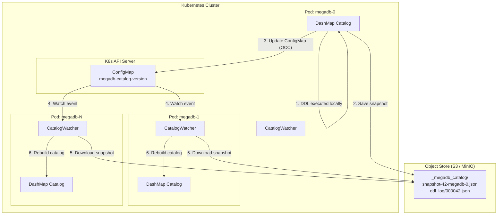

데이터베이스를 만들고 있다. 그것도 시작한 지 4일째. 보통은 잘 하지 않는 — 아니, 할 생각조차 잘 하지 않는 — 종류의 작업이다. 이 이야기를 꺼냈을 때 한 데이터 엔지니어가 "재미있겠다"고 했는데, 사실 재미있는 정도가 아니라 배우는 것이 엄청나게 많다.

사실 이 프로젝트의 출발점은 좀 엉뚱한 데 있었다. 최근 Claude Code를 쓰면서 코드 생성의 수준이 상당히 올라왔다는 걸 체감하고 있었는데, 문득 궁금해진 거다. "이걸로 대체 어디까지 만들 수 있는 걸까?" 간단한 웹 앱이나 CLI 도구 수준이 아니라, 정말로 복잡한 시스템 소프트웨어 — 예를 들면 데이터베이스 같은 것 — 을 만들 수 있을까? 그래서 "직접 데이터베이스를 만들어보면 어떨까?" 하는 생각으로 시작했다.

결론부터 말하면, AI 없이는 완전히 불가능한 영역이었을 것이다. 4일 만에 PR 398개를 머지하고, 10개 Rust crate로 구성된 멀티모델 데이터베이스 엔진이 TPC-H 벤치마크를 돌리고 있다는 건 — 솔직히 나 혼자서는 상상도 할 수 없는 속도다. 물론 Claude Code가 모든 걸 알아서 해준 건 아니다. 아키텍처 결정, 패러다임 간의 트레이드오프, 어떤 문제를 먼저 풀 것인가 하는 우선순위는 여전히 사람의 영역이다. 하지만 그 결정이 내려지면 구체적인 구현이 거의 미친 속도로 진행된다는 점은 확실하다.

---

최근 클라우드 관련 비용 및 설정 정보를 대규모로 다루는 영역에 일이 있어서, 이 데이터를 들여다보게 되었는데 생각보다 훨씬 복잡할 뿐만 아니라, 매일매일의 데이터 처리 규모 역시 엄청나고, 이 데이터들이 여러 방식으로 참조되어야 하는 문제가 여러 가지로 얽혀 있다는 것을 알게 되었다. AWS만 해도 SKU가 수백만 건에 달하고, GCP도 약 9만여 건, Azure 역시 그에 못지않은 규모의 SKU를 가지고 있다. 십수만 개의 CSP 계정에서 발생하는 수십억 건의 리소스와 의존성 정보가 매일 TB 단위로 쌓인다. 여기까지는 그냥 큰 테이블을 잘 다루면 되는 문제처럼 보인다.

그런데 실제로 이 데이터로 뭔가 의미 있는 일을 하려고 하면 이야기가 달라진다. "이 리소스를 바꾸면 어떤 앱에 영향이 가나?" — 이건 그래프 문제다. "지난 12개월 비용 추이가 어떻게 됐나?" — 이건 OLAP 분석이다. "비슷한 설정의 리소스가 다른 곳에도 있나?" — 이건 벡터 유사도 검색이다. "지금 이 리소스의 설정은 뭔가?" — 이건 OLTP 조회다. 하나의 비즈니스 질문에 답하려면 서로 다른 성격의 데이터베이스를 서너 개 횡단해야 하는 상황이 꽤 자주 발생한다.

물론 각각의 전용 시스템을 연결해서 쓸 수도 있다. 실제로 많은 곳에서 그렇게 하고 있고. 하지만 그 사이를 ETL 파이프라인으로 잇고, 데이터 정합성을 맞추고, 조인 레이어를 만들고 유지하는 일은 — 실제로 해본 사람이 많지 않아서 잘 드러나지 않지만 — 생각보다 훨씬 어려운 일이다.

여기에 또 하나의 문제가 있다. 기존 데이터베이스들은 각자 수많은 기능을 내장하고 있는데, 정작 내가 필요한 기능만 골라서 쓸 수가 없다. 그래서 여러 개의 데이터베이스를 가져다 쓰게 되면, 각 시스템에 중복되는 기능이 겹치면서 혼란과 낭비가 필연적으로 발생한다. 스토리지 관리, 인증, 모니터링, 백업 — 시스템마다 각자의 방식이 있고, 운영팀은 그걸 전부 따로 익히고 유지해야 한다. AWS가 초창기에 Cisco 스위치를 쓰다가 직접 네트워크 스위치를 만들기로 한 이유와 비슷한 맥락이라고 본다. Cisco 스위치는 포트당 전력 소모가 크고, 실제로 필요한 것보다 훨씬 많은 기능이 들어 있었다. 쓰지 않는 기능이 전력과 비용을 잡아먹고 있었던 거다. 데이터베이스도 마찬가지다 — 필요하지 않은 기능까지 포함된 시스템 여러 개를 운영하느라 자원이 낭비되고 있다면, 정말 필요한 것만 넣은 하나를 만드는 편이 결국 더 효율적일 수 있다.

---

여기에 하나 더 신경 쓰이는 게 있었다. 클라우드 인프라는 기본적으로 무한 확장이 가능하다는 전제 위에 설계되는데, 정작 그 위에서 돌아가는 데이터베이스들은 여전히 전통적인 설계를 벗어나지 못하는 경우가 많다. 노드를 추가하려면 데이터를 재분배해야 하고, 그게 TB 규모면 몇 시간씩 걸리기도 한다. Kubernetes 위에서 애플리케이션은 KEDA로 30초 만에 스케일아웃하는데, 데이터베이스는 그런 세상에 살고 있지 않은 것이다.

또 하나는 하드웨어 가속 이야기다. 데이터 처리 애플리케이션 영역에서는 GPU 가속이 이미 일반화되었다. cuDF, RAPIDS 같은 도구들이 그렇고. 그런데 데이터베이스 엔진 내부에서 집계 연산이나 그래프 순회, 압축 해제 같은 작업에 GPU나 FPGA를 적극적으로 쓴다는 이야기는 HeavyDB, PG-Strom 같은 소수의 사례를 제외하면 들어본 적이 별로 없다. 데이터 애플리케이션과 데이터베이스가 하는 일이 상당 부분 겹치는데, 왜 데이터베이스 쪽에서는 이걸 잘 안 쓰는 걸까 하는 의문이 있었다.

---

그래서 만들기 시작한 것이 MegaDB다. Rust로 작성하고 있고, Kubernetes 위에서 네이티브하게 돌아가는 멀티모델 데이터베이스 엔진이다. PostgreSQL 호환 인터페이스를 가지고 있고, 하나의 시스템 안에 다섯 가지 데이터 처리 패러다임을 넣었다.

SQL 실행 엔진은 처음부터 만든 게 아니라, Apache DataFusion v43을 기반으로 했다. SQL 파싱, 논리 계획, 물리 계획, Arrow RecordBatch 기반의 벡터화 실행, 100개 이상의 빌트인 함수까지 — 이걸 밑바닥부터 구현하려면 약 10만 줄의 코드와 수년의 엔지니어링이 필요하다. DataFusion이 이 부분을 잘 만들어진 Rust crate로 제공해주고 있어서, MegaDB는 그 위에 자기만의 계층을 얹는 방식을 택했다.

구체적으로는 DataFusion의 옵티마이저 파이프라인에 MegaDB의 커스텀 규칙 세 개 — 워크로드 분류(MegaDBClassifierRule), 비용 분석(MegaDBCostAnalyzerRule), EXPLAIN 확장(MegaDBExplainRule) — 를 주입하는 bridge 구조다. 전체 파이프라인을 대체하는 것(약 5만 줄, 고위험)도 고려했지만, 그러면 DataFusion이 수년간 다듬어온 옵티마이저와 실행 엔진의 이점을 버리게 된다. 반대로 아무 통합 없이 DataFusion만 쓰면, MegaDB가 자체적으로 구현한 4,400줄 이상의 옵티마이저 코드(7개 규칙, 비용 모델, 하드웨어 리라이터)가 죽은 코드가 된다. bridge는 그 중간을 택한 것이다.

스토리지 계층도 DataFusion과 빈틈없이 연결되어 있다. OLAP(Parquet), OLTP(RowEngine), Memory(MemoryEngine) 세 개의 스토리지 티어가 각각 전용 TableProvider를 통해 DataFusion에 등록된다. OLAP은 Parquet 파일 단위로 파티션을 나누어 병렬 스캔하고, OLTP와 Memory는 GenericScanExec라는 범용 실행 노드로 처리한다. `CREATE TABLE ... USING OLAP`으로 테이블을 만들면 자동으로 해당 티어의 Provider가 할당되고, filter pushdown, projection pushdown, 통계 기반 조인 리오더링이 티어에 관계없이 동작한다.

여기에 MegaDB 고유의 커스텀 함수도 DataFusion에 등록해뒀다. 60개 이상의 스칼라 UDF(해시, 퍼지 매칭, 지오, JSON, 벡터 거리, 머니, 인코딩), 15개의 집계 UDAF(HyperLogLog 기반 근사 NDV, t-digest 기반 근사 퍼센타일, Count-Min Sketch 기반 top-K 등), 6개의 테이블 반환 UDTF(generate_series, json_array_elements 등)가 HTTP, PostgreSQL wire, gRPC 어떤 프로토콜로 접속하든 동일하게 사용 가능하다.

OLAP은 Apache Iceberg + Parquet 조합으로 S3/GCS/Azure Blob에 저장한다. 수십억 행짜리 빌링 데이터 분석이 이 계층의 몫이다. OLTP는 Amazon Aurora에서 영감을 받은 WAL 기반 아키텍처로, CMDB나 리소스 인벤토리 같은 트랜잭션 데이터를 관리한다. In-Memory 계층은 Apache Arrow 링 버퍼로, 말 그대로 서브 마이크로초급 접근이 필요한 핫 데이터용이다. Vector는 임베딩 유사도 검색, Graph는 리소스 의존성 탐색과 영향 분석을 담당한다.

테이블을 만들 때 `CREATE TABLE ... USING OLAP` 이런 식으로 스토리지 엔진을 지정할 수 있다. 이건 꽤 직관적이라고 생각한다. 빌링 데이터는 OLAP으로, 리소스 인벤토리는 OLTP로, 세션 캐시는 MEMORY로 — 데이터의 성격에 맞게 엔진을 고르면 된다.

정리하면, MegaDB는 DataFusion이라는 검증된 SQL 엔진 위에 멀티모델 스토리지와 하드웨어 가속을 얹은 구조다. 여기에 Kubernetes 환경에서의 분산 카탈로그 구조를 한번 살펴볼 필요가 있다. 모든 Pod가 동등한 위치에서 DDL을 처리하는 leaderless mesh 방식인데, 별도의 etcd 클라이언트나 ZooKeeper 없이 K8s API 서버 자체를 coordination 레이어로 활용한다.

DDL이 실행되면 해당 Pod가 로컬 카탈로그를 업데이트하고, S3에 스냅샷을 저장한 뒤, ConfigMap을 Optimistic Concurrency Control로 갱신한다. 다른 Pod들은 ConfigMap watch 이벤트를 통해 서브초 단위로 변경을 감지하고, S3에서 스냅샷을 받아 자기 카탈로그를 재구성한다. 리더 선출이 없으니 Pod 간 비대칭이 없고, DDL 충돌이 발생하면(실제로는 거의 없지만) merge + retry로 자동 해소된다.

이제 이 구조가 실제로 어떻게 확장되고 동작하는지 이야기해보자.

---

아키텍처에서 가장 공을 들인 부분은 스케일링이다. 핵심 원칙은 간단한데, 모든 차원이 독립적으로 확장되고 확장할 때 데이터 재분배가 필요 없다는 것이다.

OLAP 경로를 예로 들면, Iceberg manifest가 모든 Parquet 파일의 위치와 partition 경계를 알고 있으니, 새 worker Pod가 뜨면 manifest(수 KB짜리 JSON)를 읽고 자기 partition을 S3에서 직접 스트리밍하면 된다. 데이터를 옮길 필요가 없다. 설계상으로는 KEDA가 스케일아웃을 트리거한 시점에서 30초 이내에 새 worker가 쿼리를 처리하기 시작하는 것을 목표로 한다. OLTP도 마찬가지로, 새 Pod가 기존 공유 WAL PVC에 붙어서 마지막 checkpoint부터 replay하면 끝이다. page cache는 재구성 가능한 캐시일 뿐, WAL이 데이터의 원천이니까.

Snowflake나 BigQuery도 스토리지-컴퓨트 분리를 하지만, 스토리지 티어가 하나다. MegaDB는 MEMORY, OLTP, OLAP 세 개의 독립적인 스토리지 티어를 두고, worker별 NVMe PVC로 캐시를 자동 배치하며, warehouse라는 개념 없이 KEDA가 Prometheus 메트릭에 따라 연속적으로 스케일링한다. Kubernetes 운영을 이미 하고 있는 조직이라면, 데이터베이스 스케일링을 기존 인프라 운영 체계 안에 자연스럽게 넣을 수 있다는 점이 실질적인 장점이라고 본다.

---

하드웨어 가속 부분도 이야기해야 할 것 같다. MegaDB의 물리 플래너는 연산자별로 하드웨어 백엔드를 고르는 dispatch 방식을 쓴다. 처리할 행이 10만 건 이상이고 GPU가 있으면 GPU로, FPGA가 있으면 Parquet 압축 해제 같은 작업을 FPGA로, NPU가 있으면 비용 이상 탐지나 예측 추론을 NPU로 보내도록 설계했다. 현재 CPU 경로는 완전히 동작하고, GPU dispatch는 테스트 환경에서 검증된 상태다. FPGA와 NPU 경로는 비용 모델과 dispatch 로직은 구현되어 있지만, 실제 하드웨어에서의 검증은 아직 남아 있다. 중요한 건, 가속기가 없어도 CPU fallback으로 항상 동작한다는 점이다.

최근에는 WebGPU/wgpu 백엔드도 추가했다. CUDA가 NVIDIA 전용인 반면, wgpu는 Vulkan, Metal, DirectX12를 통해 AMD, Intel, Apple Silicon 같은 비NVIDIA GPU에서도 가속이 가능하다. 특히 Apple Silicon의 unified memory 환경에서는 host-to-device 전송 오버헤드가 없어서, offload threshold를 CUDA의 10만 행보다 낮은 5만 행으로 잡았다. 개발 머신이 M 시리즈 Mac인 경우가 많으니, 이건 꽤 실용적인 선택이라고 본다.

이게 실용적인 이유는, GPU worker를 별도 node pool에서 KEDA로 스케일링하고 안 쓸 때는 0으로 내릴 수 있기 때문이다. GPU 노드는 비싸니까, 하루에 8시간만 쓰면 비용이 67% 줄어든다. 모든 가속기 지원은 Cargo feature flag로 게이팅해놨기 때문에, 기본 빌드는 CPU 전용 바이너리가 된다. 이 부분은 꽤 중요하다고 생각하는데, "GPU가 없으면 안 돌아가는 데이터베이스"가 되면 채택 장벽이 너무 높아지니까.

여기까지가 "데이터를 어디에 저장하고, 어떤 하드웨어로 처리할 것인가"에 대한 이야기다. 다음은 "쿼리를 어떻게 똑똑하게 실행할 것인가" — 옵티마이저 이야기다.

---

별도로 비용 기반 옵티마이저도 구현했다. 이건 DataFusion의 bridge 구조 위에서 동작하는 MegaDB 자체의 옵티마이저 파이프라인인데, 3단계 7개 규칙으로 구성되어 있다. 1단계(Early)에서 상수 폴딩과 필터 단순화, 2단계(Pushdown)에서 predicate pushdown, projection pushdown, limit pushdown, 3단계(Post-join)에서 정렬 제거와 조인 리라이트를 수행한다.

비용 모델이 좀 독특한데, 스토리지 티어별로 완전히 다른 I/O 파라미터를 쓴다. MEMORY 계층은 sequential I/O 비용이 0.001이고, OLTP는 1.0, OLAP은 0.5 — 이런 식이다. random I/O는 차이가 더 극적인데, MEMORY가 0.001인 데 비해 OLAP은 10.0이다. S3 GET 레이턴시가 반영된 것이다. 이걸 기반으로 모든 연산자에 대해 scan, filter, hash join, merge join, nested loop join, hash aggregate, sort, 그래프 순회, 벡터 스캔까지 비용을 추정한다. 6개 컴포넌트(sequential I/O, random I/O, CPU, network, accelerator, memory)로 분해되는 비용 벡터라서, "이 쿼리는 왜 느린가"를 상당히 구체적으로 설명할 수 있다.

cardinality estimation도 PostgreSQL 방식을 따라 구현했다. 등가 조건은 1/NDV, 범위 조건은 히스토그램 버킷 기반, AND는 독립 가정으로 곱, OR는 inclusion-exclusion 공식을 쓴다. `ANALYZE TABLE`을 실행하면 티어별로 다른 수집 전략이 동작하는데, OLAP은 Parquet footer에서 min/max/null_count를 읽고 샘플링으로 NDV와 히스토그램을 만들고, OLTP는 Vitter's Algorithm R로 reservoir 샘플링, Memory는 Arrow 배치를 직접 풀 스캔한다. equi-depth 히스토그램 100개 버킷이 기본이고, NDV가 1만 건을 넘으면 HyperLogLog로 전환한다. BackgroundAnalyzer가 DDL/DML 이벤트를 감시하면서 통계가 일정 비율 이상 변하면 자동으로 재분석을 트리거하고, plan cache도 무효화한다.

분산 쿼리 계획도 설계해뒀다. 물리 플랜에서 Exchange 경계를 기준으로 coordinator fragment와 worker fragment로 나누는 구조인데, 각 worker fragment는 서브트리에서 가장 높은 우선순위의 하드웨어 백엔드를 요구하도록 되어 있다. 예를 들어 Filter와 HashAggregate가 둘 다 GPU를 선호하면, 그 fragment는 GPU Pod에 라우팅되는 식이다. GPU 연산자가 연속으로 나오면 중간의 Device→Host→Host→Device 전송을 제거하고 하나의 GPU 파이프라인으로 배칭하는 최적화도 계획에 포함되어 있다. 다만 현재 worker 측 fragment 실행은 아직 stub 상태라서, 실제 분산 실행은 다음 과제다.

EXPLAIN 문도 확장했다. 기본 EXPLAIN은 워크로드 분류, 연산자별 비용 분석, 하드웨어 추천까지 보여주고, `EXPLAIN ADVISOR`를 쓰면 T4, A100, RTX 4090 같은 하드웨어 프로파일별로 예상 실행 시간과 쿼리당 달러 비용을 비교해준다. 데이터베이스가 자기 위에서 돌아가는 쿼리를 보고 인프라를 조언해주는 셈이다.

여기에 재미있는 기능이 하나 더 있는데, 알고리즘 워크벤치라는 것이다. 저장된 데이터에 적용하고 싶은 SQL을 기반으로, 해당 쿼리를 효율적으로 처리하기 위한 인프라 구성을 제안해주는 기능이다. 예를 들어 수십억 행짜리 집계 쿼리를 날리면 GPU worker가 몇 대 필요한지, 어떤 partition 구조가 적합한지 같은 것을 추천해준다.

---

이제 솔직한 이야기를 좀 해보자. 기존 시스템들과의 비교다.

단일 패러다임으로 보면, MegaDB가 하는 각각의 일을 더 잘 하는 시스템이 이미 있다. OLAP은 Snowflake, BigQuery, DuckDB, ClickHouse가 훨씬 성숙하다. OLTP는 PostgreSQL이 여전히 왕좌에 있고, CockroachDB나 TiDB도 강력하다. Graph는 Neo4j가 수년간 최적화를 해왔고, Vector는 Pinecone, Milvus, pgvector 같은 특화 솔루션이 즐비하다. GPU 가속도 HeavyDB가 먼저 했다.

그러니까 MegaDB의 포지션은 "각각을 더 잘 한다"가 아니다. 이 다섯 가지가 한 시스템에 있어야만 해결되는 문제가 있느냐, 그 통합의 가치가 각 패러다임의 성능 갭을 상쇄하고 남느냐 — 이게 핵심이다.

내 판단에는, 클라우드 비용 인텔리전스라는 도메인에서는 그렇다고 본다. "이 리소스 바꾸면 어디에 영향 가나(Graph), 비용은 얼마나 변하나(OLAP), 지금 설정은 뭔가(OLTP), 비슷한 건 없나(Vector)" — 이런 질문이 실제 워크플로우에서 하나로 엮여 있기 때문이다. 이걸 시스템 네 개로 풀면 ETL 파이프라인 관리, 데이터 정합성, 조인 레이어 유지보수에 상당한 비용이 든다. MegaDB는 그 복잡성을 엔진 내부로 흡수하려는 시도다.

물론 리스크도 있다. 프로젝트가 아직 초기 단계라는 점이 가장 크다. HNSW 벡터 인덱스는 아직 `todo!()` 상태이고, GRAPH MATCH SQL 문법도 파서 통합이 남아 있다. 5개 패러다임을 하나의 시스템에서 운영하는 것 자체의 복잡성도 만만치 않을 거고, PostgreSQL이나 Snowflake의 광범위한 생태계에 비하면 신생 시스템의 한계는 분명하다.

---

그래도 지금까지 나온 숫자들을 보면, 방향은 맞다는 생각이 든다.

테스트 환경부터 이야기하면, TPC-H의 초기 벤치마크(SF=0.1)는 Apple Silicon arm64 머신에서 Rust 1.91.0, DataFusion 43 기반으로 측정했다. MinIO를 Kubernetes 위에 올리고 `kubectl port-forward`로 연결한 환경이다. HTTP API를 통한 대규모 테스트(SF=0.1~10)는 linux/amd64 환경의 k8s-dev minikube에서 12 CPU 코어, 약 15GB RAM으로 돌렸다. 대단한 하드웨어가 아닌데도 꽤 의미 있는 숫자가 나왔다.

로컬 Parquet(Pod 내부 /tmp) 기준 TPC-H 22개 쿼리의 기하평균으로, SF=0.1(25MB)은 41.9ms, SF=1.0(309MB)은 142ms, SF=10(3.2GB)은 1,340ms가 나왔다. S3(MinIO) 경로에서는 SF=0.1이 43.3ms로 로컬 대비 오버헤드가 거의 없었지만, 데이터가 커지면 이야기가 달라진다. SF=1.0은 381ms(2.68배), SF=10은 3,730ms(2.78배)로, 단일 Pod 기준으로는 오브젝트 스토리지의 네트워크 레이턴시가 분명히 드러난다. 다만 이건 단일 노드 테스트의 한계이기도 하다. S3 같은 오브젝트 스토리지는 동시 접근에 사실상 제한이 없기 때문에, Pod를 여러 대로 늘려서 MPP 방식으로 각자의 파티션을 병렬로 읽으면 이야기가 달라진다. 개별 Pod의 레이턴시는 로컬보다 높지만, 전체 처리량은 Pod 수에 비례해서 스케일하므로 최적의 처리량을 유지할 수 있다. 로컬 디스크는 단일 노드의 I/O 대역폭에 묶이지만, S3는 그런 병목이 없는 셈이다. 여기에 Parquet metadata 캐싱이나 프리페칭까지 더하면 개선 여지는 더 있다. partition pruning을 걸면 단일 연도 쿼리가 27ms로, full scan 대비 14.8배 빨라진다.

SF=10에서는 로컬 기준 22개 중 16개, S3 경로에서는 19개가 통과했고 나머지는 8GiB 메모리 제한에서 OOM이 났다. correlated subquery에서 6천만 건의 lineitem 행에 대해 큰 hash table을 만드는 쿼리들인데, spill-to-disk가 아직 구현되지 않아서 발생한 문제다. 16GiB 이상의 메모리가 있으면 통과할 것으로 보이지만, 메모리 제한 환경에서도 동작하려면 해결해야 할 과제다.

참고로, 비슷한 스케일에서 DuckDB(싱글노드 인메모리 OLAP)의 TPC-H SF=0.1 기하평균이 대략 수십 ms 수준이라는 점을 감안하면, MegaDB의 41.9ms(로컬)는 초기 구현 치고 나쁘지 않은 출발이라고 본다. 물론 DuckDB은 수년간 최적화를 거친 성숙한 시스템이고 MegaDB는 4일차이니, 직접 비교 자체가 공정하지는 않다. 다만 "방향이 크게 틀리지 않다"는 정도의 신호로는 읽을 수 있을 것 같다.

최근에는 실제 Kubernetes 배포 환경에서도 테스트를 돌렸다. AMD Ryzen 5 PRO(6코어, 14GiB RAM) 위의 Minikube에 5개 Pod를 StatefulSet으로 띄우고, 287개의 smoke test를 실행했다. 203개가 통과하고 84개는 skip(GPU/wgpu, 벡터 검색, 일부 확장 기능 등 CPU-only 빌드에 없는 기능)이었으며, 실패는 0건이었다. 같은 환경에서 TPC-H SF=0.1도 22개 쿼리 전부 통과했고, 가장 빠른 쿼리(Q22)가 10ms, 가장 느린 쿼리(Q18)가 123ms로, 반복 측정 간 분산이 낮아서 안정적인 동작을 확인할 수 있었다. 개발 머신 수준의 스펙에서도 일단 돌아간다는 걸 보여주는 결과라고 생각한다.

PR #398까지 merge된 현재 시점에서, storage engine 3-tier(MEMORY/OLTP/OLAP)는 완전 구현되었고, WAL replication과 PITR도 동작한다. SQL 엔진은 1,634줄의 AST→LogicalPlan 변환과 비용 기반 옵티마이저가 있고, 180개 이상의 built-in SQL 함수가 구현되어 있다. Graph 엔진은 BFS, PageRank, SSSP 같은 알고리즘이 CPU와 GPU 양쪽에서 돌아가고, Kubernetes operator는 CRD, Helm chart, KEDA ScaledObject, Grafana 대시보드까지 갖추고 있다.

PostgreSQL wire protocol 서버도 구현이 완료되어, `psql`이나 DBeaver, JDBC 클라이언트로 5432 포트에 직접 접속할 수 있게 되었다. HTTP REST API(8080), gRPC(50051)와 함께 세 개의 프로토콜이 하나의 프로세스에서 동시에 동작한다. TCP connection lifecycle 관리도 3계층 구조(TcpConnectionManager, ConnectionPool, QueryScheduler)로 구현해뒀다. 별도로 `psql` 스타일의 CLI 클라이언트인 msql-cli도 개발 중이고, 주요 프레임워크와 언어를 위한 클라이언트 라이브러리도 작업 중이다.

운영 비용도 계산해뒀는데, 가장 저렴한 진입점은 GCP에서 Docker Compose로 월 $99다. Kubernetes 위에 CPU worker 2대를 띄우면 월 $500 정도, GPU worker까지 추가하면 $900 정도. Spot 인스턴스와 GPU scale-to-zero를 조합하면 $400 수준까지 내릴 수 있다. 데이터베이스를 자체 운영하는 비용으로는 합리적인 범위라고 생각한다.

---

아직 남은 일이 적지 않다는 것도 솔직히 이야기해야 할 것 같다. HNSW 벡터 인덱스, GRAPH MATCH SQL 문법, CONNECT 외부 데이터 federation, catalog 영속화, 인증/TLS — 이런 것들이 다 끝나야 비로소 "프로덕션에서 써볼 만하다"고 말할 수 있을 것이다. 현재 버전은 0.1.0 수준이고, 오픈소스로 공개하기엔 아직 이른 시점이다. 하지만 열심히 개발하다 보면 나중에 공개할 시점이 올 거라고 생각한다.

더 먼 미래에는 Kafka/Kinesis 스트리밍 인제스트, CDC, 멀티 테넌시, WASM UDF 같은 것들도 계획에 있다.

---

4일간 이 프로젝트를 진행하면서 배우는 것이 정말 많다. 데이터베이스를 새로 만든다는 건 솔직히 무모한 도전이긴 하다. 기존 시스템들이 수십 년간 다듬어온 최적화와 생태계를 단기간에 따라잡을 수는 없다. 당연히 프로덕션으로 사용하려면 오랜 기간의 검증이 필요할 것이다. 하지만 데이터베이스라는 전문 시스템 소프트웨어가 실제로 동작하는 방식을 이해하는 도구로서는, 이보다 좋은 방법을 찾기 어려울 것 같다. WAL이 어떻게 durability를 보장하는지, MVCC가 왜 그렇게 설계되는지, partition pruning이 실제로 얼마나 극적인 차이를 만드는지 — 문서로 읽는 것과 직접 구현해보는 것 사이에는 엄청난 간극이 있다.

그리고 Claude Code의 역할도 새삼 실감한다. 이 도구가 없었다면, 이런 구체적인 생각을 4일 만에 398개의 PR로 구현하는 건 완전히 불가능했을 것이다. 아키텍처 방향을 잡고, 트레이드오프를 결정하고, 어디서 타협할지 판단하는 건 여전히 사람의 몫이지만, 그 결정을 코드로 옮기는 속도가 이전과는 차원이 다르다. AI 도구와 함께 일하는 경험이 이런 수준까지 왔다는 걸, 데이터베이스를 만들어보면서 확실히 체감하고 있다.

클라우드 비용 인텔리전스라는 꽤 구체적인 도메인에서 시작하여, 실제 워크로드가 요구하는 대로 패러다임을 통합해 나가는 접근은 — 범용 데이터베이스를 처음부터 목표로 하는 것보다는 — 실현 가능성이 있다고 본다. Kubernetes 네이티브, 하드웨어 가속, 도메인 특화 멀티모델 — 이 세 가지를 동시에 추구하는 데이터베이스는 내가 아는 범위에서는 많지 않다. 이 좁지만 깊은 교차점에서 실질적인 가치를 증명할 수 있다면, 그 다음 이야기가 가능해질 것이다.

계속 작업하면서 실제 데이터를 반영해보고, 공유할 사항이 생기면 또 이야기하려 한다.
