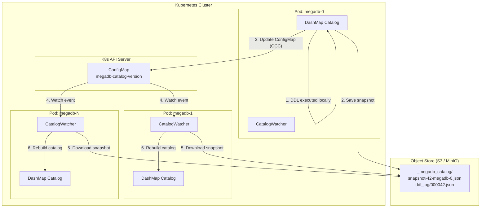

I'm building a database. Four days in, as of now. This is the kind of work you don't usually do — or even think about doing. When I mentioned it, a data engineer said "that sounds fun." Honestly, it's beyond fun — the amount I'm learning is enormous.

The starting point of this project was actually a bit unexpected. I'd been using Claude Code recently and realized that the quality of code generation has improved quite significantly. And then I got curious: "How far can you really take this thing?" Not just simple web apps or CLI tools — could it build something truly complex, like systems software? A database, for instance? That's how the thought "why not just build a database myself?" got started.

To cut to the conclusion: this would have been completely impossible without AI. Merging 398 PRs in four days, and having a multi-model database engine composed of 10 Rust crates running TPC-H benchmarks — that's a pace I couldn't have imagined on my own. Of course, Claude Code didn't do everything by itself. Architecture decisions, trade-offs between paradigms, prioritizing which problems to solve first — that's still the human's domain. But once those decisions are made, the concrete implementation proceeds at an almost absurd speed.

---

I've recently been working in an area that deals with cloud cost and configuration data at massive scale. When I dug into the data, I found it was far more complex than I expected — not only is the daily processing volume enormous, but the data needs to be referenced in multiple different ways, and these problems are tangled together in all sorts of directions. AWS alone has millions of SKUs, GCP has around 90,000, and Azure operates at a comparable scale. Hundreds of thousands of CSP accounts generate billions of resource and dependency records, accumulating at TB-scale daily. Up to this point, it looks like a problem you can solve by just handling big tables well.

But when you actually try to do something meaningful with this data, the story changes. "If I change this resource, which apps are affected?" — that's a graph problem. "What's the cost trend over the last 12 months?" — that's OLAP analytics. "Are there similar configurations somewhere else?" — that's vector similarity search. "What's the current configuration of this resource?" — that's an OLTP lookup. It's surprisingly common to need to traverse three or four different types of databases just to answer a single business question.

Sure, you can connect separate specialized systems for each. That's what a lot of organizations do. But stitching them together with ETL pipelines, maintaining data consistency, and building and maintaining join layers — not many people have actually done this, so it doesn't get talked about much, but it's a much harder problem than you'd think.

There's another issue on top of that. Existing databases each come packed with a huge number of built-in features, but you can't just pick and choose the ones you actually need. So when you end up using multiple databases, overlapping features across systems inevitably create confusion and waste. Storage management, authentication, monitoring, backup — each system has its own approach, and your ops team has to learn and maintain all of them separately. I see a parallel with why AWS decided to build their own network switches early on instead of continuing to use Cisco. Cisco switches consumed a lot of power per port and came loaded with far more features than were actually needed. Unused features were eating up power and cost. Databases are the same — if you're running multiple systems each carrying features you don't need, building one system with only what you actually need might end up being more efficient.

---

There was one more thing that bothered me. Cloud infrastructure is designed on the premise of infinite scalability, yet the databases running on top of it often can't break free from traditional designs. Adding nodes means redistributing data, and at TB scale, that can take hours. On Kubernetes, applications scale out with KEDA in 30 seconds, but databases don't live in that world.

Then there's hardware acceleration. In the data processing application space, GPU acceleration is already mainstream — tools like cuDF and RAPIDS. But I've rarely heard of database engines actively using GPUs or FPGAs internally for aggregation, graph traversal, or decompression — aside from a few examples like HeavyDB and PG-Strom. Data applications and databases do a lot of overlapping work, so I've wondered: why don't databases embrace this more?

---

That's how MegaDB got started. It's written in Rust, runs natively on Kubernetes, and is a multi-model database engine with a PostgreSQL-compatible interface. It packs five data processing paradigms into a single system.

The SQL execution engine wasn't built from scratch — it's based on Apache DataFusion v43. SQL parsing, logical plans, physical plans, vectorized execution on Arrow RecordBatch, over 100 built-in functions — building all of that from the ground up would take roughly 100,000 lines of code and years of engineering. DataFusion provides this as well-crafted Rust crates, so MegaDB chose to layer its own functionality on top.

Specifically, it's a bridge architecture that injects three custom MegaDB rules into DataFusion's optimizer pipeline — workload classification (MegaDBClassifierRule), cost analysis (MegaDBCostAnalyzerRule), and EXPLAIN extension (MegaDBExplainRule). Replacing the entire pipeline (~50,000 lines, high risk) was considered, but that would mean throwing away the optimizer and execution engine that DataFusion has refined over years. On the other hand, using DataFusion without any integration would leave MegaDB's own 4,400+ lines of optimizer code (7 rules, cost model, hardware rewriter) as dead code. The bridge is the middle ground.

The storage layer is also tightly integrated with DataFusion. Three storage tiers — OLAP (Parquet), OLTP (RowEngine), Memory (MemoryEngine) — are each registered with DataFusion through dedicated TableProviders. OLAP partitions by Parquet file for parallel scanning, while OLTP and Memory are handled through a generic execution node called GenericScanExec. When you create a table with `CREATE TABLE ... USING OLAP`, the corresponding tier's Provider is automatically assigned, and filter pushdown, projection pushdown, and statistics-based join reordering work regardless of the tier.

On top of this, MegaDB's custom functions are registered with DataFusion as well. Over 60 scalar UDFs (hashing, fuzzy matching, geo, JSON, vector distance, money, encoding), 15 aggregate UDAFs (HyperLogLog-based approximate NDV, t-digest-based approximate percentile, Count-Min Sketch-based top-K, etc.), and 6 table-valued UDTFs (generate_series, json_array_elements, etc.) are available identically whether you connect via HTTP, PostgreSQL wire protocol, or gRPC.

OLAP stores data in Apache Iceberg + Parquet on S3/GCS/Azure Blob. Analyzing billions of rows of billing data is this tier's job. OLTP uses a WAL-based architecture inspired by Amazon Aurora, managing transactional data like CMDB and resource inventories. The In-Memory tier is an Apache Arrow ring buffer — for hot data that needs sub-microsecond access. Vector handles embedding similarity search, and Graph handles resource dependency traversal and impact analysis.

When creating a table, you specify the storage engine with something like `CREATE TABLE ... USING OLAP`. I think this is quite intuitive. Billing data goes to OLAP, resource inventories to OLTP, session caches to MEMORY — you pick the engine that matches the nature of the data.

In summary, MegaDB is an architecture that layers multi-model storage and hardware acceleration on top of DataFusion, a proven SQL engine. It's worth taking a look at the distributed catalog structure in the Kubernetes environment. It's a leaderless mesh approach where every Pod handles DDL on equal footing — leveraging the K8s API server itself as the coordination layer, without a separate etcd client or ZooKeeper.

When a DDL is executed, the Pod updates its local catalog, saves a snapshot to S3, then updates the ConfigMap via Optimistic Concurrency Control. Other Pods detect the change within sub-second latency through ConfigMap watch events, download the snapshot from S3, and rebuild their own catalogs. With no leader election, there's no asymmetry between Pods, and if DDL conflicts occur (which is practically never), they're automatically resolved through merge + retry.

Now let's talk about how this structure actually scales and operates.

---

The part of the architecture where the most effort went is scaling. The core principle is simple: every dimension scales independently, and scaling never requires data redistribution.

Take the OLAP path as an example. Since the Iceberg manifest knows the location and partition boundaries of every Parquet file, when a new worker Pod spins up, it reads the manifest (a few KB of JSON) and streams its partitions directly from S3. No data movement needed. The design goal is for a new worker to start processing queries within 30 seconds of KEDA triggering scale-out. OLTP works similarly — a new Pod attaches to the existing shared WAL PVC and replays from the last checkpoint. The page cache is just a reconstructible cache; the WAL is the source of truth.

Snowflake and BigQuery also separate storage and compute, but they have a single storage tier. MegaDB has three independent storage tiers (MEMORY, OLTP, OLAP), automatically places caches on per-worker NVMe PVCs, and scales continuously via KEDA based on Prometheus metrics — without the concept of warehouses. For organizations already running Kubernetes, the practical advantage is that database scaling can be naturally integrated into the existing infrastructure operations framework.

---

I should also talk about hardware acceleration. MegaDB's physical planner uses a dispatch approach that selects the hardware backend per operator. If there are 100,000+ rows to process and a GPU is available, it goes to the GPU. If an FPGA is available, tasks like Parquet decompression get dispatched to the FPGA. If an NPU is available, cost anomaly detection and predictive inference go to the NPU. Currently, the CPU path is fully operational, and GPU dispatch has been verified in a test environment. The FPGA and NPU paths have their cost models and dispatch logic implemented, but actual hardware validation is still pending. The important thing is that it always falls back to CPU when no accelerator is available.

Recently, a WebGPU/wgpu backend was also added. While CUDA is NVIDIA-only, wgpu enables acceleration on non-NVIDIA GPUs like AMD, Intel, and Apple Silicon through Vulkan, Metal, and DirectX12. On Apple Silicon's unified memory architecture in particular, there's no host-to-device transfer overhead, so the offload threshold is set at 50,000 rows instead of CUDA's 100,000. Given that many development machines are M-series Macs, I think this is quite a practical choice.

The reason this matters from a practical standpoint is that GPU workers can be scaled via KEDA on a separate node pool and scaled to zero when not in use. GPU nodes are expensive, so if you only use them 8 hours a day, costs drop by 67%. All accelerator support is gated behind Cargo feature flags, so the default build produces a CPU-only binary. I think this is quite important — a database that won't run without a GPU would have too high an adoption barrier.

That covers "where data is stored and what hardware processes it." Next up is "how to execute queries smartly" — the optimizer story.

---

I also implemented a cost-based optimizer separately. This is MegaDB's own optimizer pipeline that operates on top of the DataFusion bridge structure, consisting of 3 phases and 7 rules. Phase 1 (Early) handles constant folding and filter simplification. Phase 2 (Pushdown) handles predicate pushdown, projection pushdown, and limit pushdown. Phase 3 (Post-join) handles sort elimination and join rewrite.

The cost model is somewhat unique in that it uses completely different I/O parameters per storage tier. The MEMORY tier has a sequential I/O cost of 0.001, OLTP is 1.0, OLAP is 0.5 — that kind of thing. The difference is even more dramatic for random I/O: MEMORY is 0.001 while OLAP is 10.0, reflecting S3 GET latency. Based on this, costs are estimated for every operator — scan, filter, hash join, merge join, nested loop join, hash aggregate, sort, graph traversal, vector scan. It's a cost vector decomposed into 6 components (sequential I/O, random I/O, CPU, network, accelerator, memory), which makes it possible to explain "why is this query slow?" in quite specific terms.

Cardinality estimation follows the PostgreSQL approach. Equality conditions use 1/NDV, range conditions use histogram bucket-based estimation, AND assumes independence and multiplies, OR uses the inclusion-exclusion formula. Running `ANALYZE TABLE` triggers different collection strategies per tier: OLAP reads min/max/null_count from Parquet footers and builds NDV and histograms through sampling; OLTP uses Vitter's Algorithm R for reservoir sampling; Memory does a full scan of Arrow batches directly. The default is 100 equi-depth histogram buckets, switching to HyperLogLog when NDV exceeds 10,000. A BackgroundAnalyzer watches DDL/DML events and automatically triggers re-analysis when statistics change beyond a certain threshold, invalidating the plan cache as well.

Distributed query planning has also been designed. The structure splits the physical plan into coordinator fragments and worker fragments at Exchange boundaries, where each worker fragment requires the highest-priority hardware backend in its subtree. For example, if both a Filter and HashAggregate prefer GPU, that fragment gets routed to a GPU Pod. When consecutive GPU operators appear, the optimization plan includes eliminating intermediate Device→Host→Host→Device transfers and batching them into a single GPU pipeline. However, worker-side fragment execution is currently still in stub status, so actual distributed execution is a task for next.

The EXPLAIN statement has been extended as well. The basic EXPLAIN shows workload classification, per-operator cost analysis, and hardware recommendations. Using `EXPLAIN ADVISOR` provides a comparison of estimated execution time and per-query dollar costs across hardware profiles like T4, A100, and RTX 4090. It's essentially the database looking at the queries running on it and advising on infrastructure.

There's one more interesting feature — the algorithm workbench. Based on SQL you want to run against stored data, it proposes infrastructure configurations for efficiently processing those queries. For example, if you submit an aggregation query over billions of rows, it recommends how many GPU workers you need, what partition structure would be appropriate, and so on.

---

Let me be honest about some things. Here's how it compares with existing systems.

Looking at individual paradigms, there are already systems that do each of MegaDB's jobs better. For OLAP, Snowflake, BigQuery, DuckDB, and ClickHouse are far more mature. For OLTP, PostgreSQL still sits on the throne, and CockroachDB and TiDB are strong contenders. For Graph, Neo4j has been optimizing for years. For Vector, specialized solutions like Pinecone, Milvus, and pgvector abound. HeavyDB pioneered GPU acceleration too.

So MegaDB's position isn't "doing each one better." The real question is: are there problems that can only be solved when all five exist in one system, and does the value of that integration outweigh the performance gap in each individual paradigm? That's the core of it.

In my judgment, the answer is yes — at least in the domain of cloud cost intelligence. "If I change this resource, what's affected (Graph)? How does the cost change (OLAP)? What's the current configuration (OLTP)? Is there something similar (Vector)?" — these questions are linked together in actual workflows. Solving this with four separate systems means significant costs in ETL pipeline management, data consistency, and join layer maintenance. MegaDB is an attempt to absorb that complexity inside the engine.

Of course, there are risks. The biggest one is that the project is still in its early stages. The HNSW vector index is still in `todo!()` status, and GRAPH MATCH SQL syntax still needs parser integration. The complexity of running five paradigms in a single system is nothing to take lightly, and as a newborn system, its limitations compared to PostgreSQL's or Snowflake's vast ecosystems are obvious.

---

Still, looking at the numbers so far, I feel the direction is right.

Starting with the test environment: the initial TPC-H benchmarks (SF=0.1) were measured on an Apple Silicon arm64 machine with Rust 1.91.0, DataFusion 43. MinIO was deployed on Kubernetes and connected via `kubectl port-forward`. Large-scale tests via HTTP API (SF=0.1~10) were run on a linux/amd64 k8s-dev minikube with 12 CPU cores and about 15GB RAM. Not impressive hardware, but the numbers turned out to be quite meaningful.

Using geometric means of TPC-H's 22 queries on local Parquet (Pod-internal /tmp): SF=0.1 (25MB) came in at 41.9ms, SF=1.0 (309MB) at 142ms, SF=10 (3.2GB) at 1,340ms. On the S3 (MinIO) path, SF=0.1 was 43.3ms — virtually no overhead compared to local. But as data grows, the story changes. SF=1.0 was 381ms (2.68x), SF=10 was 3,730ms (2.78x), clearly showing object storage network latency at single-Pod scale. That said, this is also a limitation of single-node testing. Object storage like S3 has virtually no limit on concurrent access, so scaling out to multiple Pods reading their own partitions in parallel MPP-style changes the picture. Individual Pod latency is higher than local, but overall throughput scales proportionally with Pod count, maintaining optimal processing capacity. Local disk is bound by single-node I/O bandwidth, but S3 has no such bottleneck. Add Parquet metadata caching and prefetching, and there's more room for improvement. With partition pruning, a single-year query comes in at 27ms — 14.8x faster than a full scan.

At SF=10, 16 out of 22 queries passed on local and 19 on S3, with the rest hitting OOM under the 8GiB memory limit. These are correlated subquery cases building large hash tables against 60 million lineitem rows — it's because spill-to-disk isn't implemented yet. They'd likely pass with 16GiB+ of memory, but this is a challenge that needs solving for memory-constrained environments.

For reference, considering that DuckDB (single-node in-memory OLAP) achieves roughly tens of milliseconds on TPC-H SF=0.1 at a similar scale, MegaDB's 41.9ms (local) is a decent starting point for an initial implementation. Of course, DuckDB is a mature system with years of optimization while MegaDB is on day four, so a direct comparison isn't exactly fair. But I think it can at least be read as a signal that "the direction isn't fundamentally wrong."

Recently, tests were also run in an actual Kubernetes deployment environment. On Minikube running on an AMD Ryzen 5 PRO (6 cores, 14GiB RAM), 5 Pods were deployed as a StatefulSet and 287 smoke tests were executed. 203 passed, 84 were skipped (GPU/wgpu, vector search, and other features not present in CPU-only builds), and there were 0 failures. TPC-H SF=0.1 on the same environment also passed all 22 queries — the fastest (Q22) at 10ms, the slowest (Q18) at 123ms — with low variance across repeated runs, confirming stable operation. I think this shows that it at least runs on development-machine-grade specs.

As of the current point with PR #398 merged, the 3-tier storage engine (MEMORY/OLTP/OLAP) is fully implemented, and WAL replication and PITR are operational. The SQL engine has 1,634 lines of AST→LogicalPlan conversion plus a cost-based optimizer, with over 180 built-in SQL functions. The Graph engine runs algorithms like BFS, PageRank, and SSSP on both CPU and GPU. The Kubernetes operator comes with CRD, Helm chart, KEDA ScaledObject, and Grafana dashboards.

The PostgreSQL wire protocol server is also complete, so you can connect directly to port 5432 with `psql`, DBeaver, or JDBC clients. Three protocols — HTTP REST API (8080), gRPC (50051), and PostgreSQL wire — run simultaneously in a single process. TCP connection lifecycle management is implemented with a 3-layer structure (TcpConnectionManager, ConnectionPool, QueryScheduler). A `psql`-style CLI client called msql-cli is also under development, along with client libraries for major frameworks and languages.

Operational costs have been estimated as well. The cheapest entry point is $99/month with Docker Compose on GCP. Running 2 CPU workers on Kubernetes costs about $500/month, and adding GPU workers brings it to around $900. Combining spot instances with GPU scale-to-zero can bring it down to the $400 range. I think this is a reasonable range for self-operating a database.

---

I should also be honest that there's still quite a bit of work left. HNSW vector index, GRAPH MATCH SQL syntax, CONNECT external data federation, catalog persistence, authentication/TLS — all of these need to be completed before I can say "it's worth trying in production." The current version is at the 0.1.0 level, and it's still too early for an open-source release. But I believe that as development continues, the time to share it publicly will come.

Further out, things like Kafka/Kinesis streaming ingest, CDC, multi-tenancy, and WASM UDFs are also on the roadmap.

---

I'm learning an incredible amount from these four days of working on this project. Building a database from scratch is, frankly, a reckless challenge. You can't catch up in a short time with the optimizations and ecosystems that existing systems have refined over decades. Obviously, it would need a long period of validation before production use. But as a tool for understanding how specialized system software like a database actually works, I'd be hard-pressed to find a better approach. How WAL guarantees durability, why MVCC is designed the way it is, how dramatic a difference partition pruning actually makes — there's an enormous gap between reading about these things and implementing them yourself.

And I'm also reminded of Claude Code's role. Without this tool, turning these concrete ideas into 398 PRs in four days would have been completely impossible. Setting the architectural direction, deciding trade-offs, judging where to compromise — that's still the human's job. But the speed at which those decisions get translated into code is on a different level from before. Building a database has made me keenly feel just how far the experience of working with AI tools has come.

Starting from the fairly specific domain of cloud cost intelligence and integrating paradigms as the actual workload demands — rather than aiming for a general-purpose database from the outset — seems to me like a viable approach. A database that simultaneously pursues Kubernetes-native operation, hardware acceleration, and domain-specific multi-model capabilities — there aren't many that I'm aware of. If we can prove practical value at this narrow but deep intersection, then the next chapter becomes possible.

I'll keep working, test it against real data, and share more when there's something worth talking about.
